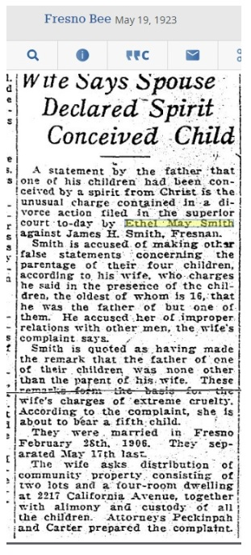

## Hi there 👋

  

--- image deleted --- NOT NEEDED

# Valley Trees: EthYl MAY .. Smith

  
  

## Casting Couch & Freedom Fighters

  
  

## Cobwebs

  

<!--
**everestso/everestso** is a ✨ _special_ ✨ repository because its `README.md` (this file) appears on your GitHub profile.

Here are some ideas to get you started:

- 🔭 I’m currently working on ...
- 🌱 I’m currently learning ...
- 👯 I’m looking to collaborate on ...
- 🤔 I’m looking for help with ...
- 💬 Ask me about ...
- 📫 How to reach me: ...
- 😄 Pronouns: ...
- ⚡ Fun fact: ...
-->
