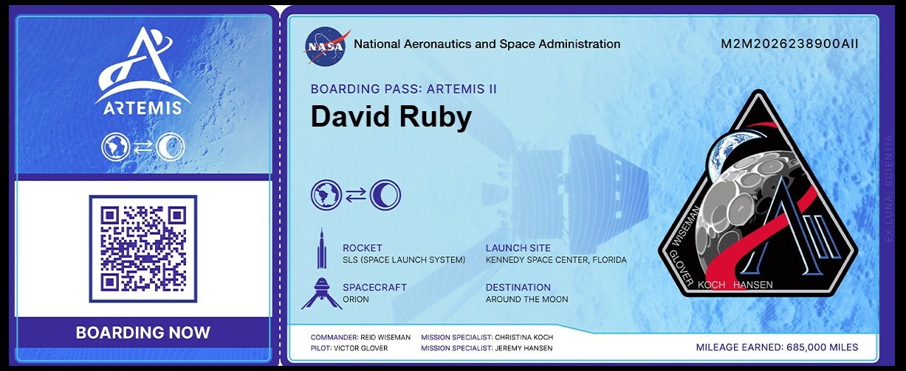

  

[https://www.wsj.com/politics/policy/trump-to-add-100-000-fee-to-h-1b-visas-e41ffe48?st=4M4BEQ](https://www.wsj.com/politics/policy/trump-to-add-100-000-fee-to-h-1b-visas-e41ffe48?st=4M4BEQ)

# 🛰️ NASA VIPER Program: AI, Autonomy & Ames

## 🧠 The Role of NASA Ames Research Center

Located in California’s Silicon Valley, **NASA Ames** plays a central leadership role in VIPER's development, especially for:

### 1. **Mission Management**
- VIPER is **managed and led by Ames**.
- The **Mission Operations Center (MOC)** and **Mission Science Center (MSC)** are both located at Ames and designed to support 24/7 lunar surface operations.

### 2. **Software Development**
- Ames developed both:
  - **Rover Flight Software (RFSW):** onboard control systems, fault detection, mobility logic, and sensor integration.
  - **Rover Ground Software (RGSW):** mission planning tools, mapping, hazard analysis, and rover driving interfaces.
- Built on **open-source technologies** like **ROS 2** for modularity and real-time autonomy.
- Designed to support **semi-autonomous lunar navigation** with limited human input due to communication delays.

### 3. **Simulation & Testing**
- Created high-fidelity **lunar simulation environments** using Gazebo and custom plugins for regolith, lighting, and mobility modeling.
- Ran **hardware-in-the-loop testing** using virtual processors and emulators.
- Operated **“Roverscape”** at Ames, a physical testbed for evaluating mobility and navigation on simulated lunar terrain.

### 4. **AI-Driven Autonomy**
- Developed advanced **AI systems** for:
  - Terrain classification and slip prediction
  - Autonomous hazard detection and route planning
  - On-the-fly decision-making for scientific sampling and navigation

---

## 🌌 Why Ames?

NASA Ames has decades of experience in:
- Autonomous systems
- Robotic navigation
- Planetary surface operations
- Simulation and mission software development

VIPER was positioned to be the most advanced robotic mission **ever led from Ames**, combining AI, software, hardware, and science integration.

---

## 🧪 Technology Snapshot

| System | Developed at Ames |
|--------|-------------------|
| Mission Operations Center (MOC) | ✅ |
| Rover Ground Software (ROS 2 tools, mapping) | ✅ |
| Rover Flight Software (core logic, autonomy) | ✅ |
| Terrain simulation & lunar environment modeling | ✅ |
| Science integration & planning interface | ✅ |

---

## 🚧 Program Status Update (2024–2025)

### ❌ Program Cancellation

- In **July 2024**, NASA officially **cancelled the VIPER mission** due to:
  - Budget overruns
  - Technical delays (especially with its commercial lander)
  - Risk of further disruptions to Artemis-related science

### 🧩 Partnership & Revival Efforts

- NASA issued a **Request for Information** and later a **formal partnership proposal call** in late 2024.
- Goal: Find a commercial/international partner to **launch and operate VIPER** using their own lander, with NASA supplying the rover “as-is.”
- **11 proposals** were received. However, in **May 2025**, NASA **canceled the solicitation**, citing insufficient options under existing terms.
- VIPER currently has **no assigned mission**, but NASA states it is "exploring alternative methods" to utilize the rover or its instruments.

### 🔄 Current Rover Status

- VIPER is **fully assembled and tested** (including vibration, EMI, and most integration).
- The rover remains at NASA facilities (likely Johnson or Ames), awaiting a revised mission opportunity.
- NASA has not ruled out using VIPER in a future mission, but no timeline or vehicle is confirmed.

---

## 🔮 Will VIPER Fly on an Artemis Mission?

At present:
- VIPER is **not assigned** to any Artemis launch.
- It could fly **only if a new launch and lander solution emerges**, either through commercial partnership or internal NASA reallocation.
- The science goals (water ice detection, volatile mapping) remain key to Artemis — even if VIPER itself does not perform them.

---

## 📅 Original Timeline (Pre-Cancellation)

- **Final system testing:** 2023–2024
- **Original launch window:** November 2024 → later slipped to late 2025
- **Mission duration:** ~100 days on the lunar surface

---

## 🔗 Learn More

- [NASA VIPER Mission Page](https://www.nasa.gov/viper)
- [NASA Ames Research Center](https://www.nasa.gov/ames)
- [VIPER Tech Brief (NASA Technical Reports)](https://ntrs.nasa.gov/api/citations/20240010930/downloads/viper-tech-2024-08-26.pdf)
- [NASA Cancels VIPER Mission – SpacePolicyOnline](https://spacepolicyonline.com/news/nasa-evaluating-11-viper-proposals-as-congress-asks-questions/)
- [VIPER Partnership Solicitation Termination – NASA Science](https://science.nasa.gov/lunar-science/volatiles-partnership/)

---

> “VIPER remains one of the most sophisticated planetary science robots ever built — even if it never leaves Earth.”

# 🤖 AI in NASA’s Artemis Program

## Overview
Artificial Intelligence (AI) is a key enabler in NASA's Artemis program, supporting everything from autonomous navigation to fuel optimization and mission planning. By integrating advanced AI systems, NASA is enhancing the safety, precision, and efficiency of lunar missions.

## 🚀 How AI Supports Artemis

### ✅ Mission Planning
- AI algorithms assist in simulating and optimizing flight plans.
- Machine learning helps predict environmental conditions and resource needs.
- AI improves scheduling of surface activities and resource use.

### ✅ Navigation & Control
- AI helps with **autonomous navigation** for crewed and uncrewed vehicles.
- Real-time data from sensors are processed by AI systems for obstacle avoidance, mapping, and path planning.
- Reduces astronaut workload and increases system adaptability in uncertain environments.

---

## 🌕 **Spotlight: VIPER — NASA’s AI-Powered Lunar Rover**

### 🛰️ What is VIPER?

- **VIPER** stands for **Volatiles Investigating Polar Exploration Rover**.
- It’s a **robotic lunar rover** that will explore the Moon’s **South Pole**, where scientists believe water ice may be hidden in permanently shadowed craters.

### 🧠 AI Capabilities

- **Autonomous Navigation:**  
  VIPER uses advanced AI to decide its path across challenging, uncharted lunar terrain — without needing constant direction from Earth.

- **Real-Time Decision-Making:**  
  It can process sensor data on the fly to detect hazards, adjust its path, and explore efficiently.

- **Resource Mapping:**  
  AI helps VIPER analyze subsurface composition as it drills and samples, identifying water ice deposits critical for future human missions.

### 📅 Mission Timeline

- **Launch Target:** November 2024  
- **Mission Duration:** ~100 days  
- **Landing Site:** Lunar South Pole, near Nobile Crater

---

## 🌌 Why It Matters

- VIPER’s mission will provide **essential data for Artemis III and beyond**, including where astronauts can find and use lunar water ice.
- The rover demonstrates the **potential of AI to operate independently on other worlds**, setting the stage for future Mars and deep space missions.
- Autonomous systems like VIPER reduce communication delays and human intervention, which are critical for sustainable lunar operations.

---

## 🧠 Future of AI in Artemis

- Continued development of **autonomous lunar infrastructure** (rovers, habitats, energy systems).
- AI-based **predictive maintenance** and **life support optimization** for human habitats.
- **Collaborative autonomy** where AI systems support astronauts during EVA and construction activities.

---

> “VIPER is not just exploring the Moon — it’s pioneering a new generation of robotic intelligence in space.”  
> — NASA Science Mission Directorate

---

🔗 **Learn more:** [NASA VIPER Mission](https://www.nasa.gov/viper) | [Artemis Program](https://www.nasa.gov/specials/artemis/)

# 🚀 The Wild Story of Jack Parsons and the Origins of JPL

## Who Was Jack Parsons?

Jack Parsons (born Marvel Whiteside Parsons) was a brilliant, self-taught chemist and rocketry pioneer. In the 1930s and 40s, he helped lay the foundations of American space exploration — all while living a double life steeped in occultism, fringe science, and rebellion.

- **Co-founder** of what became the **Jet Propulsion Laboratory (JPL)**.
- Played a key role in the creation of America’s **first rocket motor technologies**.
- Never earned a college degree — yet transformed theoretical rocketry into practical propulsion.

## The "Suicide Squad"

In the late 1930s, Parsons joined a group of Caltech researchers known as the **Guggenheim Aeronautical Laboratory**. But they were outsiders — nicknamed the **"Suicide Squad"** because their early rocket tests had a tendency to explode.  

Their experiments in the Arroyo Seco (Pasadena) were mocked at first — but eventually gained support from the U.S. military as WWII loomed.

## JATO and the Birth of JPL

Parsons and his crew developed the first **Jet-Assisted Take-Off (JATO)** units — small rockets strapped to planes to help them launch from short runways. This tech became crucial for military aviation and marked the official **birth of JPL**, now one of NASA’s premier research facilities.

## Occult Ties and the O.T.O.

Parsons wasn't just into rockets — he was a passionate follower of **Aleister Crowley**, the British occultist and founder of **Thelema**. Parsons ran the **Agape Lodge** of the **Ordo Templi Orientis (O.T.O.)** in Pasadena, where rituals, magic, and free love flourished.

He believed science and mysticism were deeply connected — once writing:
> *“The magical and the scientific are simply two paths to the same truth.”*

## The Babylon Working and L. Ron Hubbard

In 1946, Parsons performed an infamous occult ritual called **The Babylon Working**, aiming to summon a divine feminine entity into physical form.  

His ritual partner? None other than **L. Ron Hubbard**, who would later found **Scientology**. The two had a bizarre falling-out after Hubbard allegedly absconded with Parsons’ money and girlfriend in a failed yacht-buying venture.

## Expulsion, Blacklisting, and Death

By the late 1940s, Parsons had been **expelled from JPL** due to his occult connections and increasingly erratic behavior. He was **blacklisted from government work** during the early Cold War security scares.

He died in **1952**, at age 37, in a mysterious explosion in his home lab — officially ruled an accident, though some suspected suicide or foul play.

## Legacy

Though controversial in life, Parsons was later recognized as a **pioneer of modern rocketry**:

- **JPL honors him as a co-founder**, though his occultism is largely omitted from official history.
- His work paved the way for America’s space program, from **JATO units** to deep space exploration.
- His life inspired books, documentaries, and the 2018 CBS series *Strange Angel*.

---

> “Jack Parsons was both a visionary and a madman — a man who reached for the stars while invoking ancient gods.”  
> — Space historians (probably)

# Fresno State Aerospace Engineering Program Proposal

## Vision  
To establish Fresno State as a regional leader in aerospace engineering education, producing graduates with hands‑on skills, theoretical foundations, and experience that align with industry needs and emerging space and aeronautics sectors.

## Mission  
- Educate students in aerodynamics, propulsion, systems engineering, avionics, structural design, and unmanned/crewed aerospace platforms.  
- Foster partnerships with local industry, government, and research labs for internships, co‑ops, and research.  
- Advance aerospace innovation through research in UAVs/drones, small satellites, propulsion systems, flight dynamics, and space mission design.  

## Program Structure & Curriculum (Suggested)

| Course Area | Core Courses / Topics |
|-------------|------------------------|
| **Fundamentals** | Physics; Calculus; Differential Equations; Statics & Dynamics; Materials Science |
| **Aerospace Core** | Aerodynamics; Propulsion; Flight Mechanics; Aircraft & Spacecraft Structures; Control Systems; Avionics |
| **Systems & Design** | Systems Engineering; Space Mission Design; Thermodynamics; Computational Fluid Dynamics (CFD); Orbital Mechanics |
| **Laboratories & Project-Based Learning** | Wind tunnel testing; UAV/drone design & flight; Rocketry/sounding rockets; Satellite/CubeSat design; Flight simulation |
| **Electives / Specializations** | Unmanned Aircraft Systems; Spacecraft Systems; Advanced Propulsion; Hypersonics; Aerospace Materials; Space Policy & Ethics |

## Facilities & Resources Needed

- Labs: wind tunnel(s), propulsion test stands, avionics / embedded systems lab, structural testing (fatigue, stress), flight simulator, spacecraft integration/test clean room, UAV/drone test field.  
- Faculty with expertise in aerodynamics, propulsion, avionics, control systems, structural mechanics, orbital mechanics.  
- Collaboration space for design project teams.  
- Funding sources for seed equipment, lab development, scholarships, research grants.

## Potential Industry & Research Partnerships

- Local aerospace & defense companies; drone / UAS firms.  
- NASA centers (e.g., Ames), national labs (like Lawrence Livermore), and private space companies for satellite & launch tech.  
- Government agencies (FAA, DoD) and policy/regulation groups.  
- Internships / co‑op programs for students.

## Outcomes & Metrics

- Graduates with strong technical and hands‑on skills ready for industry or graduate school.  
- Student projects (e.g., UAVs, rockets, small satellites) launched/tested.  
- Research publications and external funding.  
- Industry placement and partnership growth.  
- Accreditation (ABET) to ensure recognized standard.

## Timeline (Example Phases)

1. **Planning & Approval** (Year 1)  
   - Stakeholder consultation; curriculum development; budget & resource planning; hire initial faculty; secure lab space.  

2. **Pilot Phase** (Year 2)  
   - Offer core courses; start lab setup; initial student cohort; small‑scale project work.  

3. **Full Launch** (Year 3‑4)  
   - Full set of courses; capstone design; established labs; research projects; begin industry partnerships & internships.  

4. **Growth & Refinement** (Year 5+)  
   - Expand electives; scale up facilities; pursue accreditation; broaden research; possibly launch a satellite / rocket project.

## Budget Considerations (Rough Estimate)

- Faculty & staff salaries  
- Lab equipment & maintenance  
- Facility renovation / build of lab spaces  
- UAVs, wind tunnels, propulsion test rigs, simulators etc.  
- Student support (scholarships, travel, project materials)  
- Initial seed funding + seeking external grants  

---

# 🌕 NASA Artemis Program Summary

## Overview
The Artemis program is NASA's flagship effort to return humans to the Moon and eventually establish a sustainable presence there, paving the way for future missions to Mars. The program is named after **Artemis**, the twin sister of Apollo in Greek mythology.

## Objectives
- Return humans to the Moon, including the first woman and first person of color.
- Develop sustainable lunar exploration by the end of the decade.
- Demonstrate new technologies, capabilities, and business approaches for future missions.
- Prepare for the first human missions to Mars.

## Key Missions

### ✅ Artemis I (Completed)
- **Date:** November 16 – December 11, 2022  
- **Type:** Uncrewed test flight  
- **Details:** Successfully sent the Orion spacecraft around the Moon and back, testing systems in deep space.

### 🧑‍🚀 Artemis II (Upcoming)
- **Target Launch:** April 2026  
- **Type:** Crewed lunar flyby  
- **Details:** First crewed mission using SLS and Orion. Astronauts will orbit the Moon but not land.

### 🧑‍🚀 Artemis III (Planned)
- **Target Launch:** Mid-2027  
- **Type:** Crewed lunar landing  
- **Details:** Will land astronauts near the lunar South Pole using the SpaceX Starship Human Landing System.

### 🏗️ Artemis IV and Beyond
- **Focus:** Construction of the **Lunar Gateway**, a space station in lunar orbit.  
- **Goal:** Enable more sustainable and longer-term missions to the Moon and prepare for Mars.

## Technology
- **SLS (Space Launch System):** NASA’s new heavy-lift rocket.
- **Orion:** Deep-space crew capsule.
- **Lunar Gateway:** Planned lunar-orbit space station.
- **SpaceX Starship HLS:** Human landing system for Artemis III and beyond.

## International Partnerships
- Includes contributions from ESA (Europe), JAXA (Japan), and CSA (Canada), among others.

## Looking Ahead
The Artemis program represents a major step in humankind’s expansion into deep space. With international cooperation, commercial partners, and sustained investment in technology, it aims to enable a new era of space exploration.

---

🔗 **Learn more:** [NASA Artemis Program](https://www.nasa.gov/specials/artemis/)

  
  
  
  

<!--
**everestso/everestso** is a ✨ _special_ ✨ repository because its `README.md` (this file) appears on your GitHub profile.

Here are some ideas to get you started:

- 🔭 I’m currently working on ...
- 🌱 I’m currently learning ...
- 👯 I’m looking to collaborate on ...
- 🤔 I’m looking for help with ...
- 💬 Ask me about ...
- 📫 How to reach me: ...
- 😄 Pronouns: ...
- ⚡ Fun fact: ...
-->
