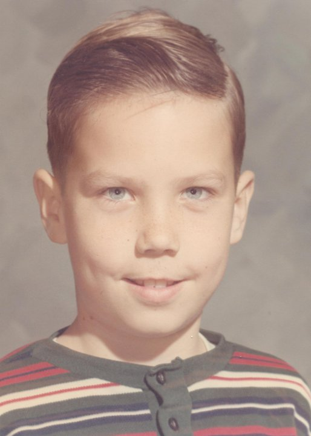
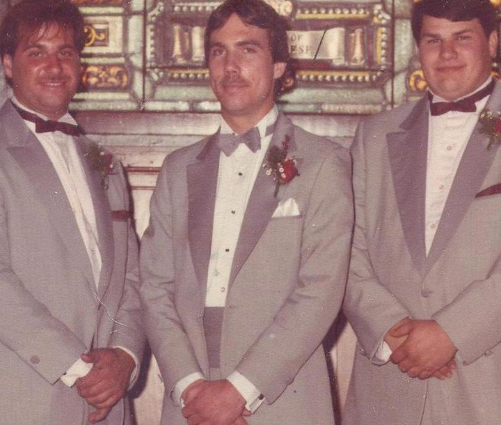
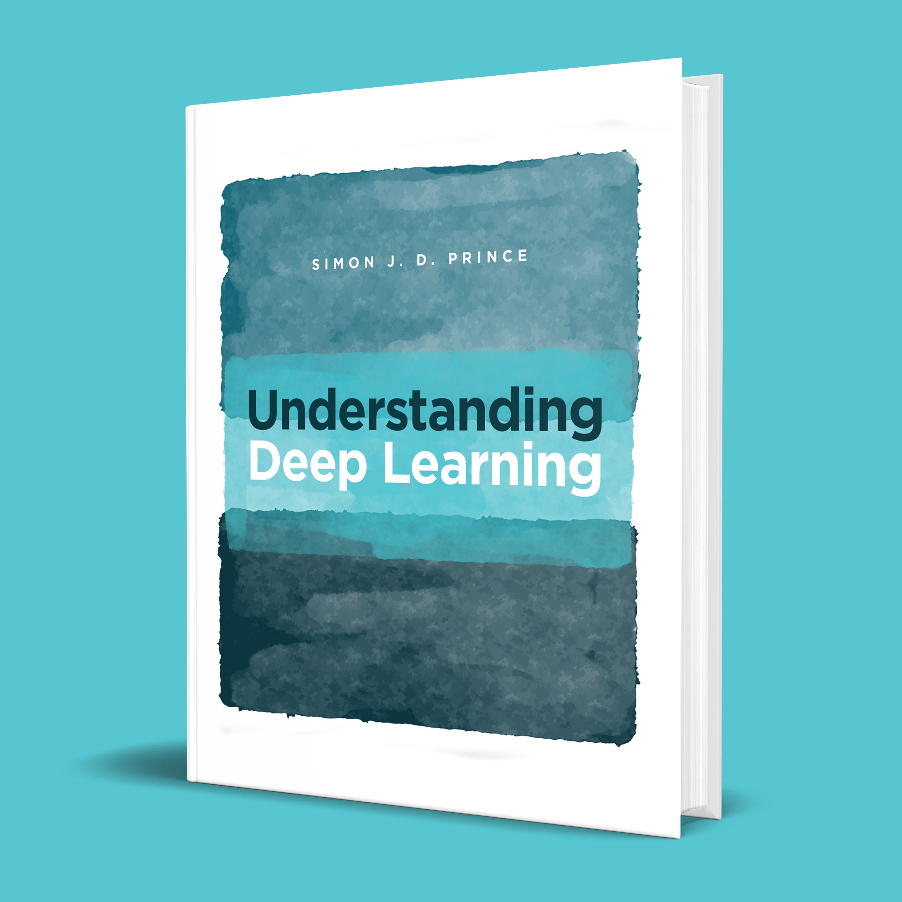
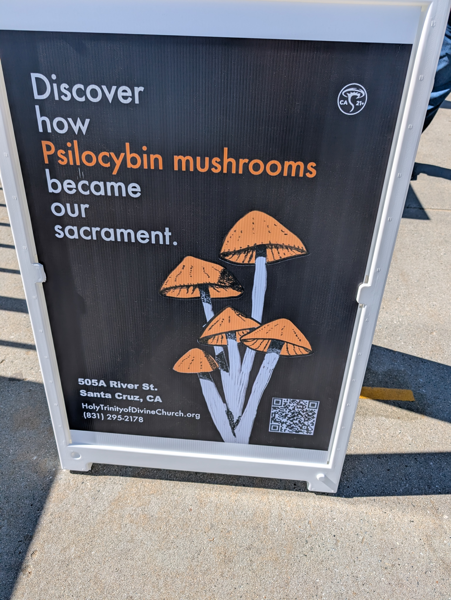
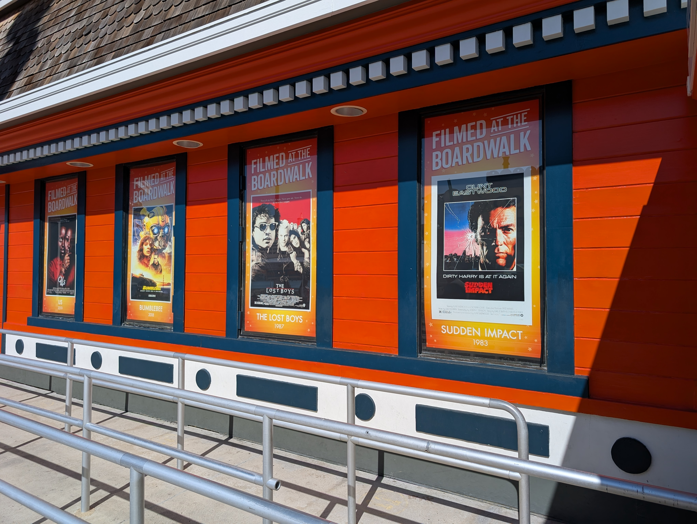

# Summer 25 TODO

[Ancestry.Com Research](https://www.ancestry.com/profile/08ff19d8-0006-0000-0000-000000000000?preview=true)

  
  
  
    

## Books

  
  
  
    

[Sound Track 1: Solar Power](https://youtu.be/wvsP_lzh2-8?si=CiRrG8rJwDUOHvwe)

[Sound Track 2: Lady by Dennis Wilson](https://youtu.be/fsevrVoJE-g?si=ecIzJKDNSfZ54CuA)

## Santa Cruz

  
  
  

<!--
**everestso/everestso** is a ✨ _special_ ✨ repository because its `README.md` (this file) appears on your GitHub profile.

Here are some ideas to get you started:

- 🔭 I’m currently working on ...
- 🌱 I’m currently learning ...
- 👯 I’m looking to collaborate on ...
- 🤔 I’m looking for help with ...
- 💬 Ask me about ...
- 📫 How to reach me: ...
- 😄 Pronouns: ...
- ⚡ Fun fact: ...
-->
