# --- LLM Reasoning ---

## Mapping Chain-Of-Thought w/ LLM.

+ Revisit COT:LLM w/ LLM saved sessions.
  
+ Repressive communities as conflict issues and frustration visualizations! ===>>> Seeing Conflicts.
+ Transformational Experiences: ??? Why ?
+ Old Links --->>> Meaning from conincident characters.
# Perspective Broadening and Destabilization in Repressive Communities

## Core Idea

**Perspective broadening can destabilize repressive communities by dissolving the cognitive foundations of control before new forms of agency are possible—but this tension reflects the ethical weight of expanded understanding, not its failure.**

---

## Explanation

Repressive communities often maintain stability through:

* Controlled or narrowly bounded narratives: **"This is how it is!!!"**
* Limited exposure to alternative viewpoints: **"Stick to your own!"**
* Strongly enforced social roles, norms, or hierarchies: **"This is who you are!"**
* Squelching, marginalizing, or co-opting internal voices within the community to maintain control and limit dissent. **"Shut-up or else trouble for you."**

Perspective broadening introduces new ways of seeing that:

* Undermine narrative monopolies
* Reveal contingency and alternative possibilities
* Weaken enforced consensus

This cognitive shift frequently occurs **faster than social, cultural, or institutional adaptation**, creating periods of instability.

---

## Why Instability Emerges

* Awareness increases before meaningful agency exists
* Familiar certainties dissolve before new shared frameworks form
* Individuals begin to reassess authority, legitimacy, and belonging

The resulting instability is not accidental—it is a predictable consequence of expanded understanding within constrained environments.

---

## Ethical Interpretation

This destabilization should not be interpreted as a failure of perspective broadening.

Instead, it reflects:

* The ethical seriousness of expanded understanding
* The power of knowledge to unsettle restrictive social arrangements
* The need for care, pacing, and contextual sensitivity

Stability maintained through cognitive restriction is not ethically neutral.

---

## Implication

Perspective broadening carries responsibility. It must be:

* Facilitated with attention to local context and consequence
* Paired, where possible, with pathways for agency and dialogue
* Understood as a long-term process rather than an immediate solution

---

## Summary Statement

**The tension between expanded understanding and social stability reflects the ethical weight of perspective broadening—not its inadequacy—especially within repressive communities.**

# Perspective Broadening through Social Navigation: Role of University and Instructors

The university occupies a uniquely important social role in facilitating **perspective broadening through social navigation**, particularly at institutions committed to **social mobility and serving first-generation college students**. For many students, college represents the first sustained engagement with peers, ideas, and professional norms beyond the boundaries of their local communities and prior educational environments.

Universities provide a protected and structured space where this encounter can unfold deliberately rather than abruptly. Within this environment, students learn to navigate difference, complexity, and plural perspectives as a form of **growth**—developing skills in communication, adaptability, and contextual understanding—while also opening the possibility for **transformational shifts** in how they understand others and their place in the world.

Instructors play a critical complementary role by modeling respectful engagement, designing learning experiences that bring diverse perspectives into productive contact, and supporting reflection without prescribing belief or identity. Together, the institution and its educators do not mandate transformation; rather, they **enable durable capacities** for social navigation and perspective-taking that support professional readiness, civic participation, and long-term social elevation.

# Transformation, Commerce, and AI: Ono, Rosenthal, and Apple

## Overview

This overview situates **Yoko Ono, Rachel Rosenthal, and Jacki Apple** within a shared lineage of **transformational art**, then extends that lineage into the contemporary domains of **commerce and AI-driven experience design**.

Together, these artists clarify how transformation moves from **ethical inquiry**, to **instrumentalized experience**, to **automated systems of influence**.

---

## Transformation in Art: Three Approaches

### Yoko Ono — Ethical Minimalism

Ono frames transformation as a **moral encounter** produced through minimal action and instruction.

* Transformation arises through **choice and restraint**
* The audience becomes **ethically implicated**
* Responsibility is exposed rather than resolved

**Key insight:** Transformation is not guaranteed; it depends on what participants choose to do when given permission.

---

### Rachel Rosenthal — Embodied Confrontation

Rosenthal treats transformation as **necessary confrontation** with ecological, political, and bodily realities.

* The artist’s body is the site of testimony
* Performance demands **witnessing and accountability**
* Transformation is emotionally intense and often uncomfortable

**Key insight:** Transformation requires facing what culture prefers to avoid.

---

### Jacki Apple — Pedagogical and Cognitive Shift

Apple approaches transformation as a **process of understanding**, achieved through language, structure, and reflection.

* Performance operates as **thinking in public**
* Emphasis on voice, narrative, and conceptual rigor
* Education itself is a transformational medium

**Key insight:** Transformation is sustained through awareness rather than shock or spectacle.

---

## From Art to Commerce: Instrumentalizing Transformation

Commercial experience design adopts the mechanics explored by these artists:

* Participation
* Emotional engagement
* Identity formation

But shifts the purpose:

* Transformation becomes a **means to conversion**
* Ethical ambiguity is minimized or ignored
* Responsibility ends at transaction or satisfaction metrics

Where art asks *whether* transformation should occur, commerce assumes that it **should—and that more is better**.

---

## The AI Extension: Automated and Personalized Transformation

AI systems extend commercial transformation by:

* Personalizing experiences at scale
* Continuously adapting to behavior and emotion
* Optimizing influence through feedback loops

Transformation is no longer episodic or reflective. It becomes:

* Continuous
* Opaque
* Asymmetrical

What was once an ethical encounter becomes an **infrastructural condition**.

---

## Why These Artists Matter Now

Ono, Rosenthal, and Apple provide critical tools for the present moment:

* **Ono** teaches caution around permission and agency
* **Rosenthal** reminds us that bodies bear consequences
* **Apple** insists on reflection and articulation

Without these frameworks, AI-driven systems risk reproducing transformation **without consent, care, or accountability**.

---

## Summary Statement

**Art treated transformation as a question; commerce turned it into a strategy; AI now threatens to make it an automated system.**

The work of Ono, Rosenthal, and Apple remains essential for understanding what ethical responsibility must mean when experiences are designed to change people.

# Required Confusion as Confusing.... or.. Trying to Understand Confusion as a Required Condition

+ Random Strikes @ Confusion: Illumination (Illumination, Illumination, Illumination) should clear obscurity/confusion.
  
| 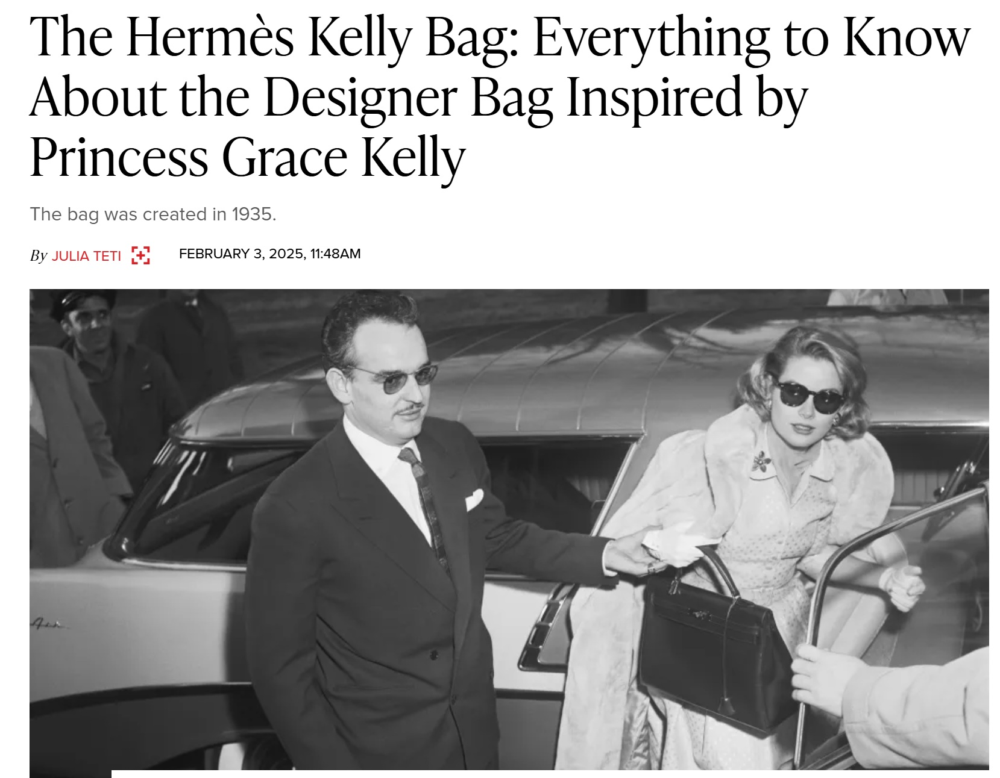 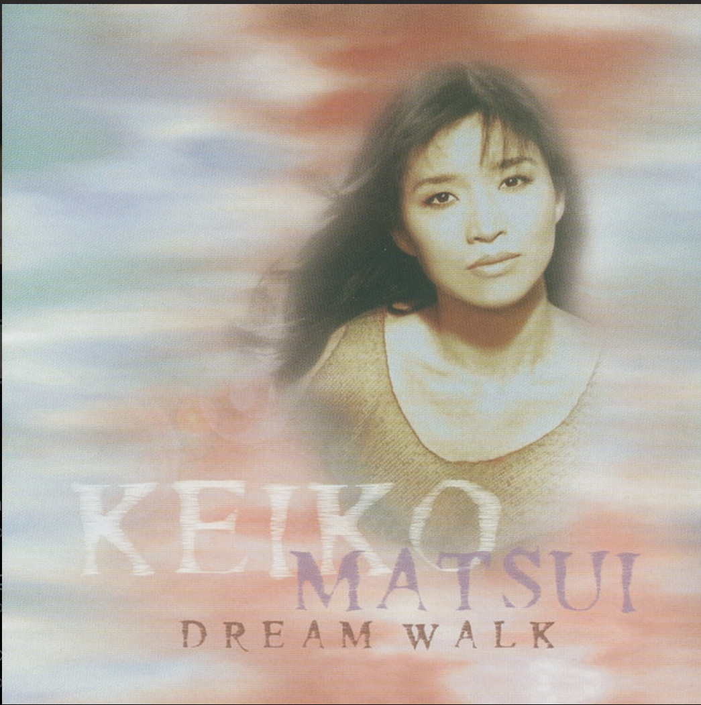|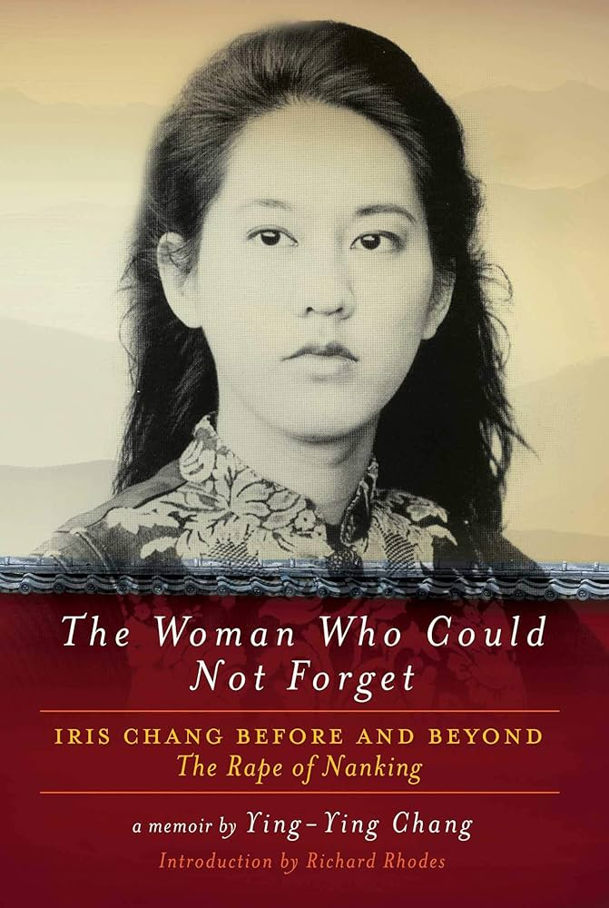 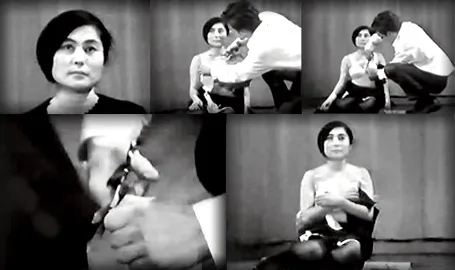||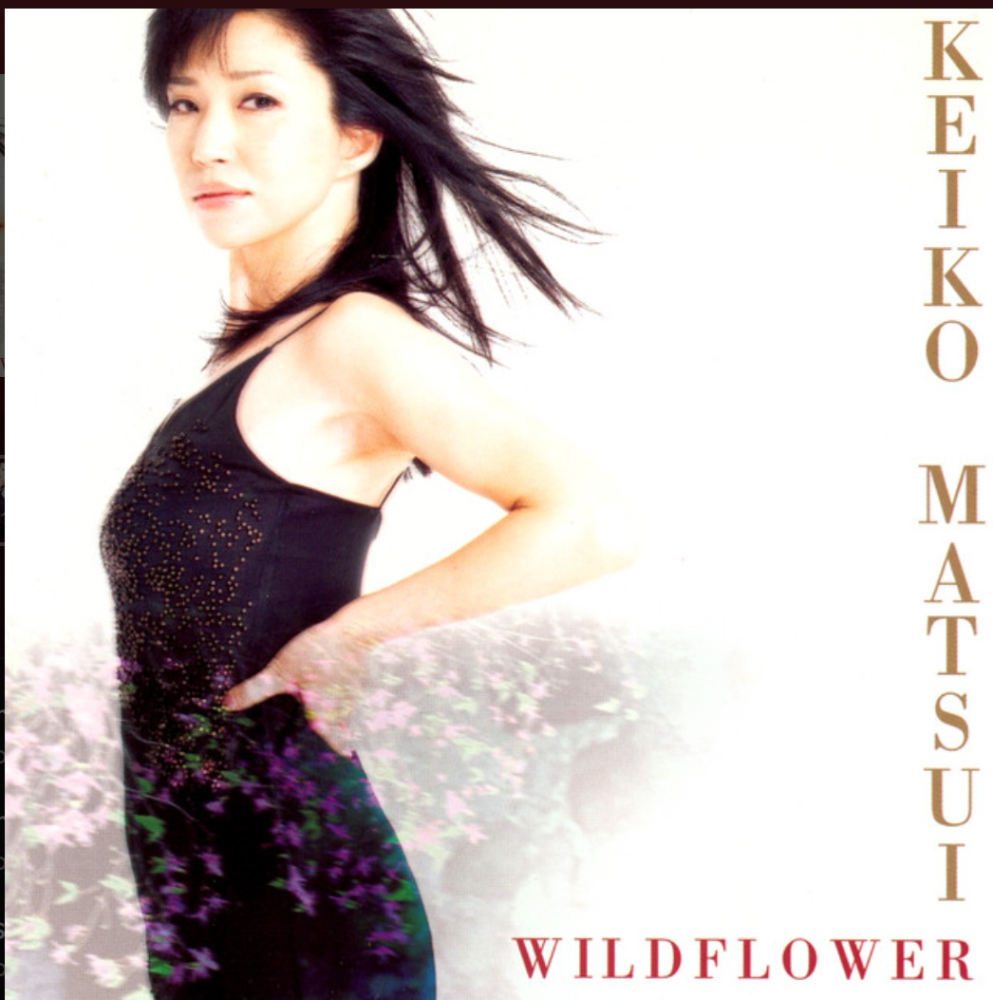| 
|:--:|:--:|:--:|:--:|
# Shared Tattoo, *Cut Piece*, and Improvised *Sleeping Beauty*: A Comparative Case

## Shared Ground

A **shared tattoo**, Yoko Ono’s *Cut Piece* (1964), and an **improvised reworking of the *Sleeping Beauty* wake-up scene** all function as **transformational, participatory experiences** rather than fixed representations. In each case:

* The **human body** is central to meaning-making
* Action unfolds in real time
* Participants are emotionally and socially implicated
* The experience exceeds the moment and lingers in memory

What distinguishes them is not whether they involve narrative, but **how agency, consent, and transformation are structured**.

---

## Case 1: Shared Tattoo

### Function

A **bonding ritual** grounded in permanence and reciprocity.

* Participation is **voluntary, mutual, and symmetrical**
* Pain and vulnerability are shared
* The outcome is **irreversible and embodied**

### Social Meaning

The tattoo marks a **collective decision** carried forward in daily life. The bond is intentional, visible, and materially sustained.

---

## Case 2: Yoko Ono’s *Cut Piece* (1964)

### Function

An **ethical exposure** that reveals the moral weight of participation.

* Participation is **asymmetrical**
* Ono remains silent and vulnerable while others act
* The work tests limits of permission, restraint, and responsibility

### Social Meaning

Transformation is primarily **ethical and internal**, forcing participants to confront how they behave when action is authorized but unconstrained.

---

## Case 3: Improvised *Sleeping Beauty* Wake-Up Scene

### Function

A **narrative-based improvisation**, where a familiar story provides **context rather than script**.

* The *Sleeping Beauty* myth supplies a shared cultural frame
* Actions, dialogue, and outcomes are **improvised in the moment**
* Participants may alter, resist, or subvert the traditional narrative

The wake-up is not predetermined; it emerges through **negotiation, responsiveness, and choice**.

### Social Meaning

Here, transformation is **relational and interpretive** rather than permanent. The improvisation allows participants to explore intimacy, consent, agency, and care without fixing those meanings in the body or in moral judgment.

The story functions as a **sandbox for experimentation**, not an instruction to be obeyed.

---

## Key Contrasts

### Agency

* **Shared tattoo:** Fully reciprocal and self-directed
* **Cut Piece:** Concentrated in the participant acting upon another
* **Improvised *Sleeping Beauty*:** Distributed and negotiated in real time

---

### Consent

* **Shared tattoo:** Explicit, informed, and forward-looking
* **Cut Piece:** Open-ended and ethically destabilizing
* **Improvised *Sleeping Beauty*:** Ongoing, situational, and renegotiable

---

### Transformation

* **Shared tattoo:** Material, permanent, and identity-forming
* **Cut Piece:** Psychological and moral
* **Improvised *Sleeping Beauty*:** Experiential, reflective, and reversible

---

### Role of Narrative

* **Shared tattoo:** Narrative is incidental or retrospective
* **Cut Piece:** Narrative is minimal or absent
* **Improvised *Sleeping Beauty*:** Narrative provides **contextual scaffolding**, not control

---

## Summary Statement

**A shared tattoo binds through irreversible mutual action; *Cut Piece* exposes the ethics of acting upon another; and an improvised *Sleeping Beauty* wake-up uses shared myth as a flexible context for negotiating intimacy, consent, and transformation in real time.**

# Case Study: Group Tattooing as Social, Artistic, and Commercial Transformation

## Context

This case study situates **group or joint tattooing** within the broader discussion of **transformational experiences**, tracing how a single social act can function differently when framed through **artistic, commercial, and systemic lenses**.

Building on earlier themes—art as action, ethical responsibility, commercialization of transformation, and the emerging AI bridge—group tattooing provides a concrete, socially legible example of how **experience produces lasting human bonds**.

---

## The Experience

Group tattooing involves two or more individuals choosing to be tattooed together, often with:

* Shared or related imagery
* Coordinated timing or ritualized sequencing
* Mutual presence and witnessing

The defining features of the experience are:

* **Physical vulnerability and pain**
* **Irreversibility and permanence**
* **Collective decision-making**
* **Public or semi-public witnessing**

From a social perspective, the tattoo is less significant than the **shared passage through the act itself**.

---

## Social Function: Bonding and Identity Formation

Anthropologically, group tattooing operates as a **bonding ritual**:

* It marks entry into a shared identity or memory
* It creates a durable symbol of affiliation
* It externalizes commitment onto the body

Unlike symbolic gestures that can be removed or abandoned, tattooing embeds the bond into daily life. The body becomes a **living archive of relationship**.

---

## Artistic Frame: Ethical and Relational Encounter

Viewed through the lens of participatory and performance art:

* The **body becomes the medium**
* The action becomes the artwork
* Meaning emerges through **vulnerability, consent, and witnessing**

As with works such as *Cut Piece*, the ethical dimension is unavoidable. Participants knowingly accept risk and permanence, and responsibility is shared among those who initiate, facilitate, and witness the act.

In this frame, transformation is **reflective rather than instrumental**.

---

## Commercial Frame: Designed Experience and Marketed Bond

In a commercial setting, the same ritual is reframed as an **experience product**:

* Tattoo studios market shared tattoos as symbols of loyalty, friendship, or love
* Emotional intensity becomes part of the value proposition
* Permanence enhances perceived authenticity and commitment

Here, transformation is not questioned but **assumed to be desirable**. Ethical responsibility often ends at informed consent and payment, leaving the long-term social consequences to participants alone.

---

## Escalating Tension: Art, Commerce, and Responsibility

This case illustrates a recurring pattern identified earlier:

* **Art** foregrounds transformation as a moral and relational question
* **Commerce** operationalizes transformation as a service or product
* **Systems (including AI)** threaten to scale and automate transformation without embodied ritual

Group tattooing sits at the boundary where these frames overlap, making ethical tensions visible rather than abstract.

---

## Why This Case Matters

From a social perspective, group tattooing demonstrates that:

* Transformational experiences naturally produce attachment
* Permanence amplifies ethical stakes
* Framing determines whether bonding is respected or exploited

It shows how easily **ritual can slide into product**, and how responsibility can diffuse as experiences become normalized and commercialized.

---

## Summary Statement

**Group tattooing reveals how a shared, irreversible action can function simultaneously as social ritual, participatory art, and commercial experience—exposing the ethical stakes of designing experiences that bind people together.**

# From Artistic Transformation to Commercial Experience and AI Persuasion

## Overview

The idea that **designed experiences can transform people** originates in modern and contemporary art, particularly participatory and performance practices. Over time, this logic migrated into **commercial experience design** and is now being extended through **AI-driven systems** that personalize, scale, and automate transformation.

This trajectory raises escalating ethical concerns as transformation moves from reflective inquiry to instrumental persuasion.

---

## 1. Artistic Transformation: Experience as Ethical Encounter

In participatory and performance art, artists design situations intended to:

* Alter perception, emotion, or self-understanding
* Engage vulnerability and attention
* Produce reflection rather than compliance

Crucially, contemporary art treats transformation as an **ethical event**:

* The artist acknowledges responsibility
* Power asymmetries are interrogated
* Harm and consent are actively debated

Transformation is the *question*, not merely the outcome.

---

## 2. Commercial Transformation: Experience as Instrument

Commercial experience design adopts the same mechanics—emotion, immersion, participation—but redirects them toward **conversion and loyalty**.

Examples include:

* Experiential marketing and brand activations
* Lifestyle branding and identity-based consumption
* Personal-development events tied to products or services

Here, transformation becomes a **means to an end**:

* Emotional impact is justified by sales
* Consent is implicit rather than informed
* Responsibility typically ends at the transaction

The ethical inquiry present in art is replaced by **performance metrics**.

---

## 3. The AI Bridge: Scaled, Personalized Transformation

AI systems extend commercial transformation by introducing:

* Personalization at scale
* Continuous adaptation based on behavior
* Predictive modeling of emotional and cognitive response

AI-driven systems now design experiences that:

* Learn what motivates individuals
* Adjust messaging in real time
* Optimize for persuasion, retention, and influence

Transformation is no longer episodic—it becomes **continuous and adaptive**.

---

## 4. Escalating Ethical Stakes

As transformation moves from art to commerce to AI, three shifts occur:

1. **Scale** – One-to-many influence replaces singular encounters
2. **Opacity** – Mechanisms of influence become harder to see
3. **Asymmetry** – Systems gain power individuals cannot reciprocate

What was once an ethical question becomes an infrastructural condition.

---

## 5. Why Art Still Matters

Artistic precedents remain critical because they:

* Name the ethical problem explicitly
* Treat participants as subjects, not targets
* Ask whether transformation should occur at all

Without this lineage, AI-driven persuasion risks normalizing **behavioral modification without accountability**.

---

## Conclusion

The historical arc is clear:

* **Art** explored transformation as a moral question
* **Commerce** operationalized transformation as a strategy
* **AI** now automates and scales transformation as a system

> **What began as an inquiry into how actions change people now confronts us as a technological capacity to do so continuously.**

The unresolved ethical questions of participatory art have become urgent design challenges in the age of AI.

# Cal Art (RESEARCH PROPOSAL): REJECTED --> Critical capabilities lacking creating credibility issues.

# Ethical Responsibility in Transformational Art

## Overview

As contemporary art increasingly engages audiences through participation, performance, and lived experience, a central question has emerged:

> **When art is transformational, does the artist have ethical responsibilities toward participants?**

This is not a peripheral concern. It is one of the defining ethical debates in contemporary art theory and practice.

---

## Why This Question Emerged

Traditional modern art assumed that:

* Art was primarily **symbolic or representational**
* Emotional responses were **private** and self-contained
* The artist’s responsibility ended with expression

These assumptions break down when art:

* Involves direct **participation**
* Produces **lasting emotional or psychological change**
* Creates **irreversible experiences**

Once art changes people, it becomes ethically consequential.

---

## Key Ethical Dimensions

### 1. Consent

* Did participants understand what they were entering?
* Was consent ongoing and revocable?
* Were risks clearly communicated?

---

### 2. Power Asymmetry

* Who controls the situation?
* Who can stop the work?
* Who gains visibility, authority, or value from the interaction?

Artists inevitably hold power when framing participatory experiences.

---

### 3. Care and Aftercare

* What happens after the artwork ends?
* Are participants left to process emotional impact alone?
* Is responsibility limited to the moment of action, or does it extend beyond it?

This concern draws from trauma-informed practice and ethics of care.

---

### 4. Exploitation vs. Transformation

* Are participants treated as collaborators or as material?
* Is discomfort justified by insight?
* Who decides whether the transformation was beneficial?

---

## Contemporary Debate

This issue is actively discussed and unresolved.

* Some argue ethical obligations **limit artistic freedom**.
* Others argue ignoring ethics reproduces harm under the guise of innovation.

Rather than resolving the tension, contemporary art often **stages it**.

---

## Current Responses in Practice

Artists and institutions increasingly adopt:

* Consent protocols
* Clear exit options
* Facilitators or mediators
* Debriefing or reflective spaces

These practices acknowledge that transformation carries responsibility.

---

## Conclusion

Transformation is no longer viewed as a neutral or incidental effect of art.

> **When art transforms participants, the artist becomes ethically entangled with the lives they affect.**

This entanglement defines one of the central moral challenges of contemporary art.

# Confusion Point ...... !!!!!!

++ When/Why Communication becomes transformational ===>>> impacting delivery.

# From Action to Bond: Participation, Instruction, and Human Relationship in Art

## Overview

Participatory and instruction-based art—especially as developed in Fluxus and conceptual art—raises a fundamental ethical and human question:

> **When does an action stop being an aesthetic gesture and become a relational bond between people?**

This document outlines how modern and contemporary art has grappled with the transformation of **action into relationship**, and why this shift complicates claims of anti-elitism, neutrality, and dematerialization.

---

## 1. Art as Action and the Fluxus Ideal

Fluxus artists in the early 1960s promoted:

* Art as **event rather than object**
* Simple actions and instructions (*event scores*)
* Anti-elitism and resistance to commodification

The intent was to dissolve hierarchy by replacing art objects with actions that anyone could perform.

**Underlying assumption:**
Actions can remain lightweight, reversible, and socially neutral.

---

## 2. The Problem: Humans Attach Meaning to Action

Human beings do not experience actions abstractly. Shared actions generate:

* Memory
* Trust
* Obligation
* Emotional attachment

As a result, even minimal participation can create **lasting interpersonal effects**.

This creates a tension:

> Fluxus sought to avoid permanence, yet human relationships naturally produce it.

---

## 3. When Action Becomes a Bonding Ritual

Anthropology and psychology suggest that an action crosses into **bonding ritual** when it includes one or more of the following:

1. **Vulnerability** – exposure, risk, or trust
2. **Reciprocity** – mutual engagement rather than one-sided action
3. **Duration** – extended or repeated interaction
4. **Irreversibility** – consequences that cannot be undone
5. **Witnessing** – being seen or acknowledged by another person

Many Fluxus works minimize these conditions. Others—such as Yoko Ono’s *Cut Piece*—activate them fully.

---

## 4. Ethical Participation: The Case of *Cut Piece*

In *Cut Piece* (1964), Ono invites audience members to cut away her clothing.

Although framed as an instruction-based performance, the work:

* Creates vulnerability and power imbalance
* Places ethical responsibility on participants
* Produces lasting emotional impact

Here, participation is no longer symbolic. It becomes **morally consequential**.

---

## 5. From Fluxus to Relational Aesthetics

By the 1990s, artists and theorists explicitly addressed the relational consequences of participation.

### Nicolas Bourriaud – *Relational Aesthetics* (1998)

Key proposition:

> The artwork is the **human relationship produced**, not the action itself.

Examples include:

* Shared meals
* Conversations
* Cooperative tasks

Bonding is no longer incidental—it is the medium.

---

## 6. Performance Art and Ethical Exposure

Artists such as **Marina Abramović** further intensified relational engagement.

### Example: *The Artist Is Present* (2010)

* Sustained eye contact
* No physical object or instruction beyond presence
* Participants report grief, attachment, and transformation

These works acknowledge that art can permanently alter participants, making ethical responsibility unavoidable.

---

## 7. Instruction, Authority, and Obedience

Instruction-based art also intersects with social psychology:

* Obedience to authority
* Compliance with permission
* Power embedded in seemingly neutral instructions

Research such as **Stanley Milgram’s experiments** highlights how instructions reshape moral boundaries.

In this light, instructions in art are never neutral once another human is involved.

---

## 8. Interdisciplinary Fields Addressing This Question

This issue now spans multiple disciplines:

* **Art Theory:** relational aesthetics, social practice art
* **Anthropology:** ritual theory, liminality, communitas (Victor Turner)
* **Philosophy:** ethics of the Other (Emmanuel Levinas), care ethics
* **Psychology:** attachment theory, group bonding, shared memory formation

Together, these fields examine how actions generate enduring human ties.

---

## Conclusion

Fluxus attempted to dissolve elitism by dissolving objects. However, **human relationships cannot be dematerialized**.

Once art involves real people performing real actions together, it inevitably produces:

* Attachment
* Responsibility
* Ethical consequence

This unresolved tension is not a failure of participatory art—it is its enduring power.

---

## Summary Statement

**An action becomes a bond when it creates vulnerability, reciprocity, and irreversible memory—and contemporary art has spent decades reckoning with the ethical weight of that transformation.**

# Yoko Ono: Brief Overview and Timeline of Artistic Development

## Overview

Yoko Ono’s artistic development moves from classical music and poetry into radical conceptual and performance art, positioning her as a foundational figure in **conceptual art, Fluxus, and participatory performance**. Across decades, her work consistently emphasizes **instruction, audience participation, ethical awareness, and the dematerialization of the art object**.

Rather than producing art as a finished commodity, Ono reframes art as an **event, action, or choice**, often completed by the viewer.

---

## Early Foundations (1933–1958)

* **1933** – Born in Tokyo, Japan, into a wealthy and intellectually engaged family
* Receives formal training in **classical piano and composition**
* Experiences wartime displacement, shaping later themes of loss and impermanence
* Moves to the United States and studies philosophy and music at **Sarah Lawrence College**

**Key influence:** Japanese aesthetics, Zen thought, and postwar consciousness

---

## Experimental Music and Conceptual Beginnings (Late 1950s–Early 1960s)

* Becomes involved in New York’s **avant-garde music scene**
* Hosts experimental performances in her downtown loft
* Associated with composers and artists connected to **John Cage** and **La Monte Young**
* Begins treating **sound, silence, and instruction** as artistic material

**Key shift:** From musical composition to conceptual structure

---

## Instruction Art and Fluxus (1962–1964)

* Develops **Instruction Paintings**, short poetic directives inviting imagined or real actions
* **1964** – Publishes *Grapefruit*, a book of instruction pieces
* Loosely affiliated with **Fluxus**, while maintaining an independent artistic voice

**Representative works:**

* *Instruction Paintings*
* *Grapefruit*

**Key idea:** Art exists as a set of directions; the viewer becomes a co-creator

---

## Performance and Ethical Participation (1964–1966)

* **1964** – First performance of *Cut Piece* in Kyoto, Japan
* The work is later performed in Tokyo, New York, and London
* **1966** – *Ceiling Painting* exhibited at Indica Gallery, London

**Conceptual development:**

* Participation becomes embodied and ethically charged
* Audience actions directly shape the artwork

**Key works:**

* *Cut Piece*
* *Ceiling Painting*

---

## Art as Activism and Public Action (Late 1960s–1970s)

* Expands art into **media, protest, and daily life**
* Creates anti-war works, public posters, and conceptual gestures
* Blurs boundaries between art, politics, and personal life

**Key idea:** Art functions as social intervention rather than gallery object

---

## Reassessment and Institutional Recognition (1980s–1990s)

* Major retrospectives and renewed scholarly attention
* Feminist art history reframes her early performances as foundational works
* Recognized as a pioneer of **conceptual and performance art**

---

## Legacy and Ongoing Practice (2000s–Present)

* Large-scale retrospectives at institutions such as **MoMA, Tate, and the Guggenheim**
* Continues producing instruction-based and participatory works
* Widely acknowledged as a precursor to **relational aesthetics** and participatory contemporary art

---

## Condensed Timeline

* **1933** – Born in Tokyo
* **1950s** – Classical music training; moves to U.S.
* **Early 1960s** – Experimental music and conceptual work in New York
* **1964** – *Grapefruit* published; *Cut Piece* first performed
* **1966** – *Ceiling Painting* exhibited in London
* **Late 1960s–1970s** – Conceptual activism and public art
* **1980s–present** – Retrospectives and sustained influence

---

## Summary Statement

Yoko Ono’s art evolves from **conceptual instruction to ethical performance and public action**, consistently redefining the roles of artist, audience, and everyday life in modern and contemporary art.

# From *Ceiling Painting* to *Cut Piece*: Yoko Ono (1964–1966)

## Overview

This brief overview traces the conceptual progression in Yoko Ono’s work from *Ceiling Painting* to *Cut Piece*, highlighting how her practice moves from participatory optimism to ethical confrontation. Across these works, Ono redefines the role of the viewer—from observer, to participant, to morally implicated actor.

---

## 1. *Ceiling Painting* (1966)

**Medium:** Installation / Instruction-based participatory work
**First shown:** Indica Gallery, London

### Description

*Ceiling Painting* invites viewers to climb a ladder, use a magnifying glass, and read a small word written on the ceiling: **“YES.”** The work is minimal, quiet, and incomplete without the viewer’s physical engagement.

### Key Concepts

* Art as **experience rather than object**
* Viewer participation as a **choice**
* Emphasis on **trust, affirmation, and possibility**
* Strong alignment with **Fluxus** principles

### Significance

The work establishes Ono’s belief that meaning is generated through participation. The act of climbing and searching becomes the artwork itself.

---

## 2. Conceptual Bridge: Instruction Pieces (1964–1965)

**Key publication:** *Grapefruit* (1964)

During this period, Ono develops her *Instruction Paintings*, works that exist as written directions rather than physical objects. These pieces often invite imagined or real actions and shift art into the realm of thought and ethical attention.

### Developments

* The artwork exists as a **set of instructions**
* The viewer becomes a **co-creator**
* Increasing focus on **immateriality** and **responsibility**

This phase provides the conceptual foundation for *Cut Piece*, where instruction and participation become embodied and consequential.

---

## 3. *Cut Piece* (1964–1966)

**Medium:** Performance art
**First performed:** Kyoto, Japan (1964); later Tokyo, New York, London

### Description

Ono sits silently on stage with a pair of scissors in front of her. Audience members are invited to approach and cut away pieces of her clothing. The performance continues until Ono decides it is finished.

### Key Concepts

* Participation as **ethical action**
* Exposure of **power dynamics**, gender, and violence
* The audience as **active agents**, not passive viewers

### Significance

Unlike *Ceiling Painting*, participation here carries risk and moral weight. The artwork unfolds according to the audience’s decisions, revealing social norms and individual limits.

---

## Timeline Summary

* **1964** – Publication of *Grapefruit* (Instruction Pieces)
* **1964** – First performance of *Cut Piece* (Kyoto)
* **1965–1966** – Performances of *Cut Piece* in New York and London
* **1966** – *Ceiling Painting* exhibited at Indica Gallery, London

---

## Conceptual Throughline

Across these works, Ono shifts participation from **affirmative engagement** to **ethical exposure**.

* *Ceiling Painting* asks the viewer to **choose to believe**.
* *Cut Piece* asks the viewer to **choose how far to go**.

Together, they mark a critical moment in the emergence of performance and conceptual art, where meaning arises not from objects, but from human action and responsibility.

# Negative Narratives
|   3:16(C:P) Yes:You are Safe! | 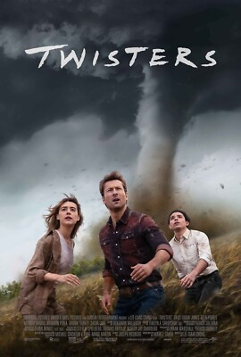 | 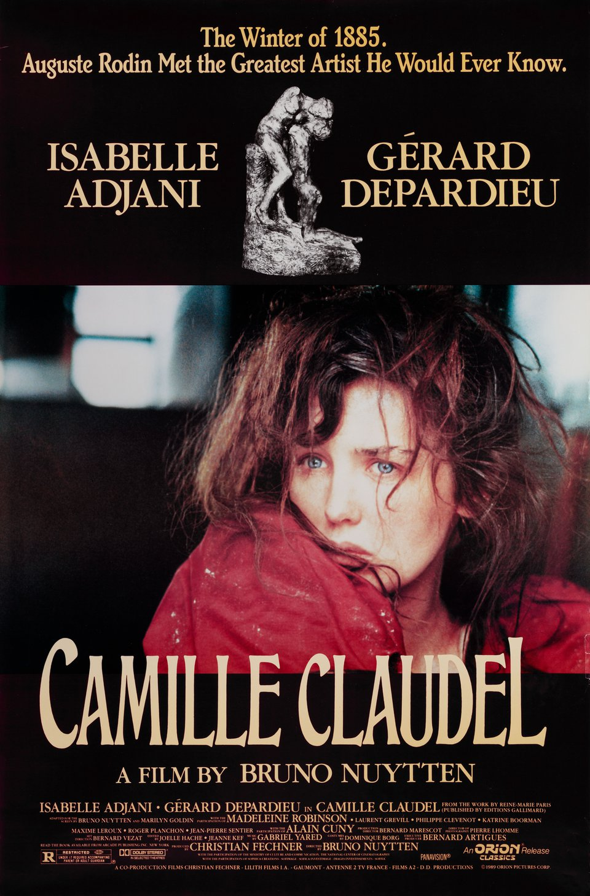 |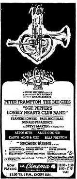|
|:--:|:--:|:--:|:--:|

# Yoko Ono — *Ceiling Painting* (1966)

## Overview
*Ceiling Painting* is an early conceptual and performance-based artwork by Yoko Ono that invites active participation from the viewer. First exhibited in London in 1966, the piece consists of a ladder positioned beneath the ceiling and a magnifying glass attached near the top.

## The Action
Participants are invited to:
1. **Climb the ladder**
2. **Look through the magnifying glass**
3. **Read a small word written on the ceiling**

The word is **“YES.”**

## Core Concepts
- **Participation:** The artwork only exists fully when a viewer engages with it.
- **Effort and ascent:** Physical climbing symbolizes curiosity, risk, and intentional engagement.
- **Affirmation:** The word “YES” offers a rare gesture of optimism in avant-garde art of the time.
- **Concept over object:** The idea and experience are more important than the physical materials.

## Artistic Significance
- A landmark example of **instruction-based and participatory art**
- Closely associated with the **Fluxus movement**
- Influential in shaping later performance and conceptual art practices
- Famously impressed John Lennon, who cited the “YES” as pivotal in his connection to Ono

## Legacy
The ladder motif became a recurring symbol in Ono’s work, representing openness, peace, and the possibility of imagining a better world through simple, intentional acts.

---
*“A dream you dream alone is only a dream. A dream you dream together is reality.”* — Yoko Ono

## PoP: Old COT Alignment <<<--->>> Arts & Humanities ===>>> Somewhat Interesting Social Science there (Xerox: 304) --->>> ???

+ Still missing all targets!

|  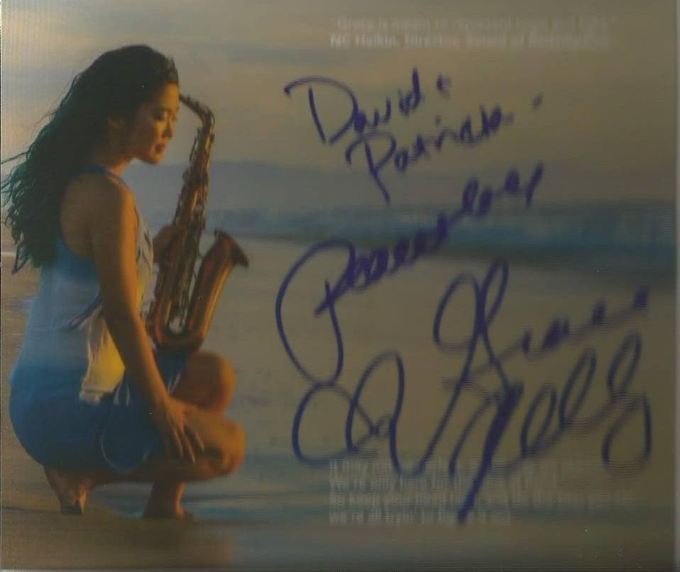 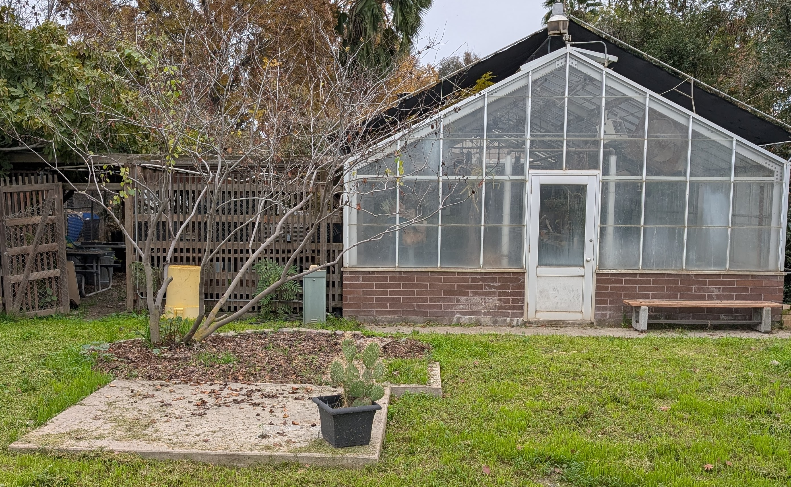|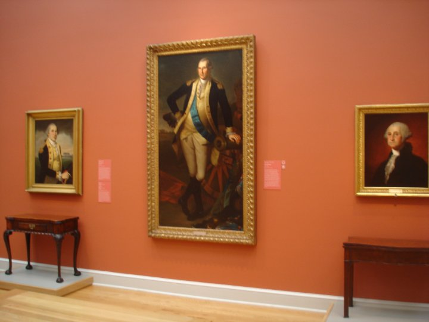 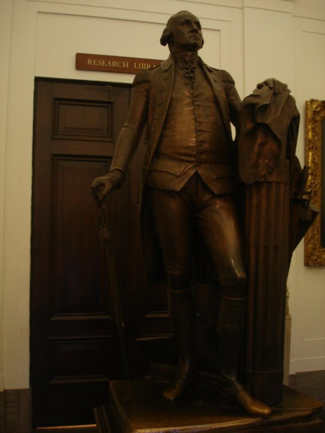 |   | [FussseeeeIon Power w/ AI](https://www.wsj.com/business/deals/trump-media-tae-technologies-merger-ai-fusion-power-b9ac22a5?st=2vqpLP&reflink=desktopwebshare_permalink)  AI Agents   aisuite <-> Cognitive Archtectures    | 
|:--:|:--:|:--:|:--:|

| RoofMan Matt 1:20 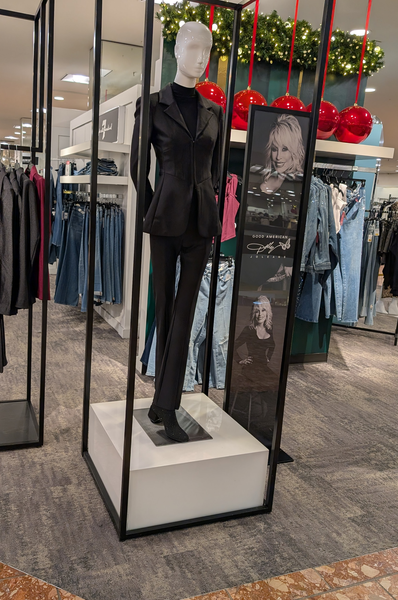 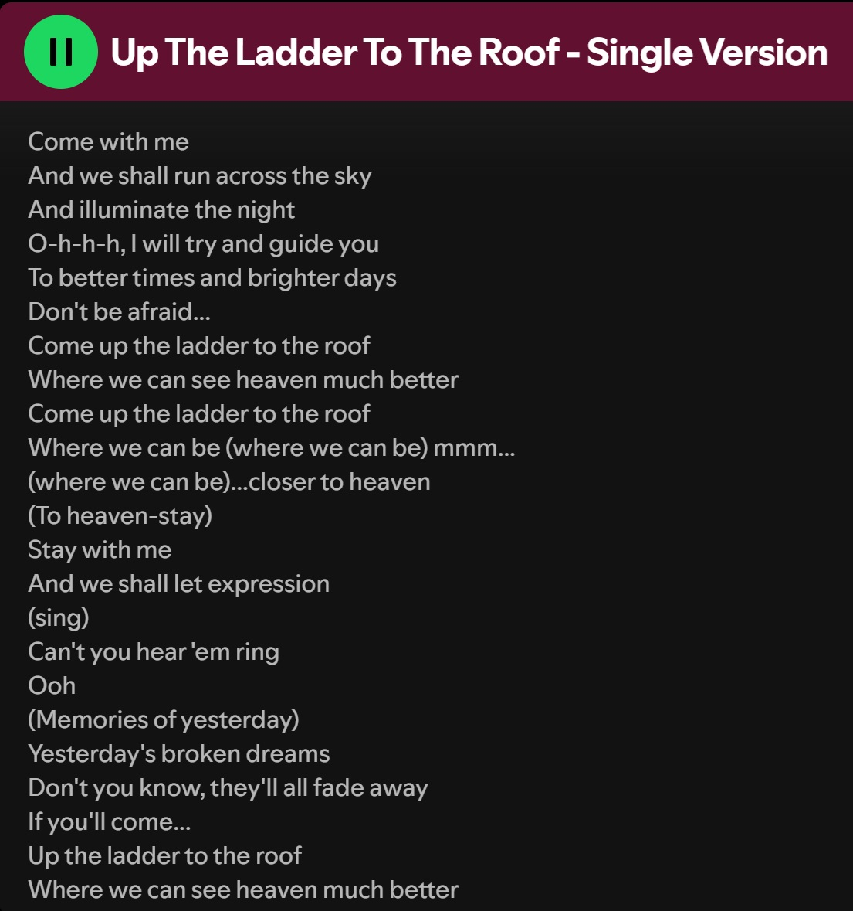 Such was his intention  when, behold, the  angel of the Lord  appeared to him in a  dream and said,  “Joseph, son of David,  do not be afraid..."| Space Invaders/Table Games (Chairs) Noise/Diversion Creations Blocking Paths    [FussseeeeIon Power w/ AI](https://www.wsj.com/business/deals/trump-media-tae-technologies-merger-ai-fusion-power-b9ac22a5?st=2vqpLP&reflink=desktopwebshare_permalink)  MySQL<->MariaDB FC<->CNN<->YOLO Agentic| RoofMan  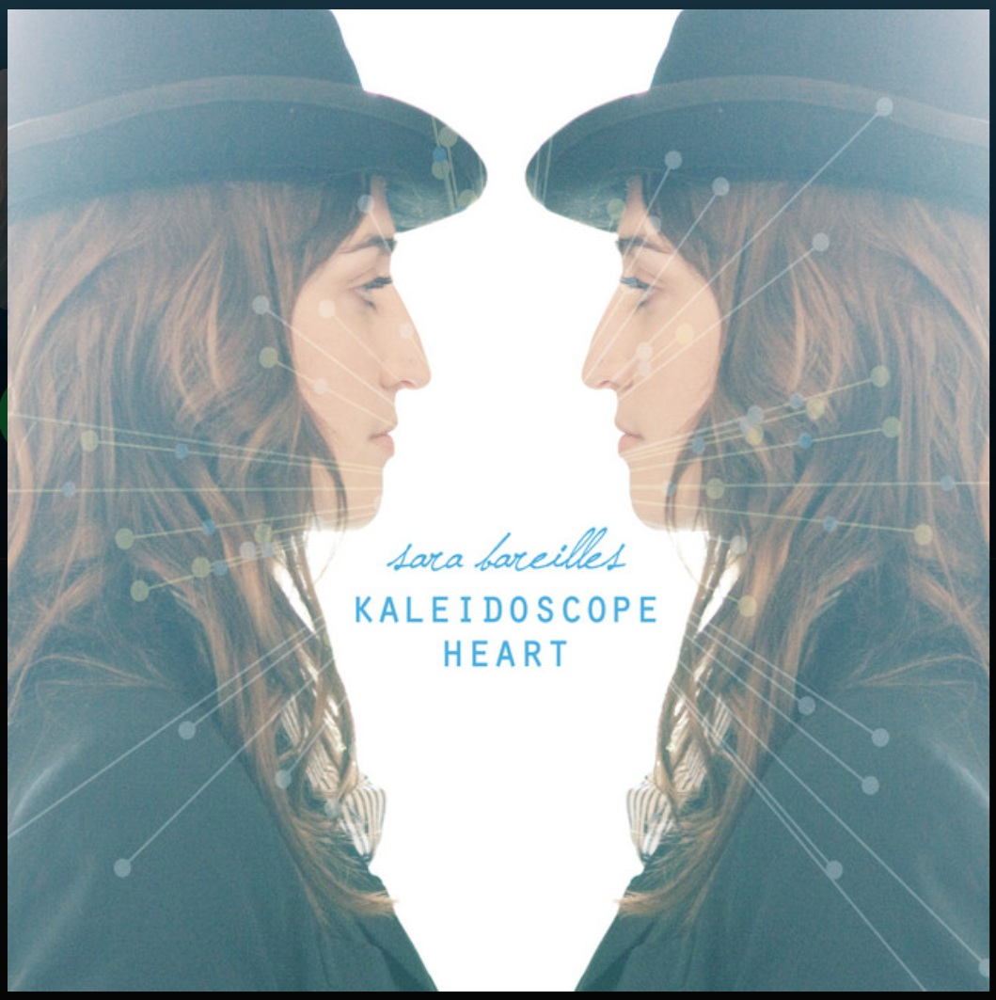 |  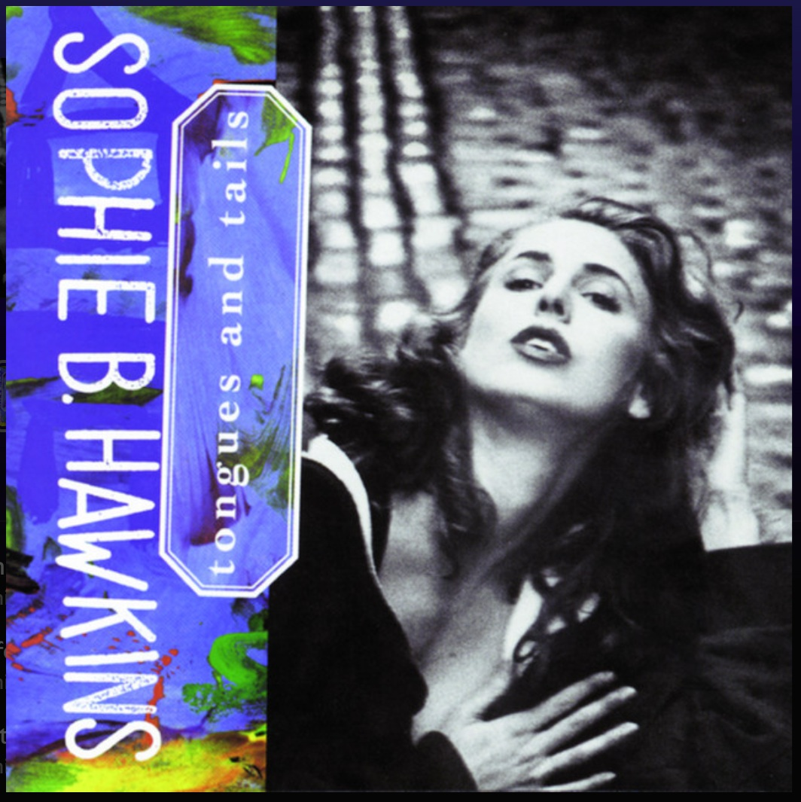   |
|:--:|:--:|:--:|:--:|

## Mapping Chain-Of-Thought Links <<<--->>> Going Out

| 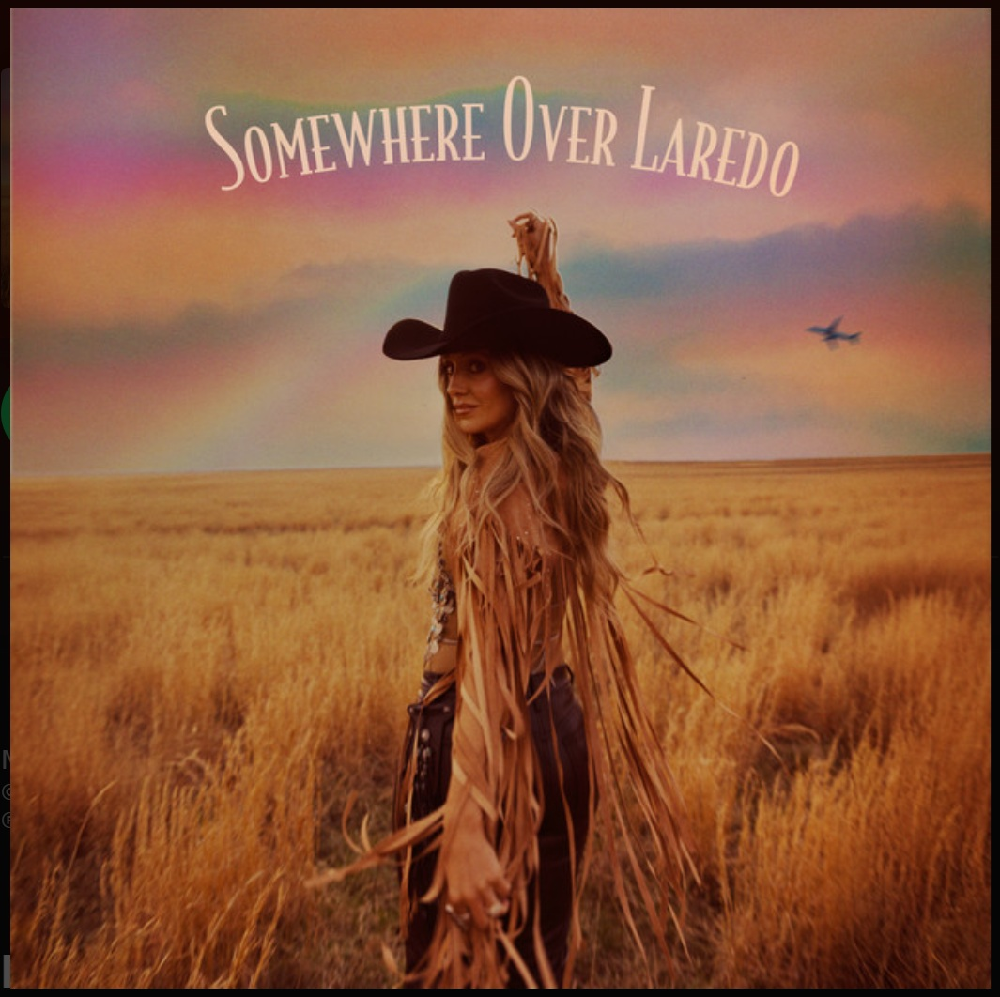  |  | **AI Agents**    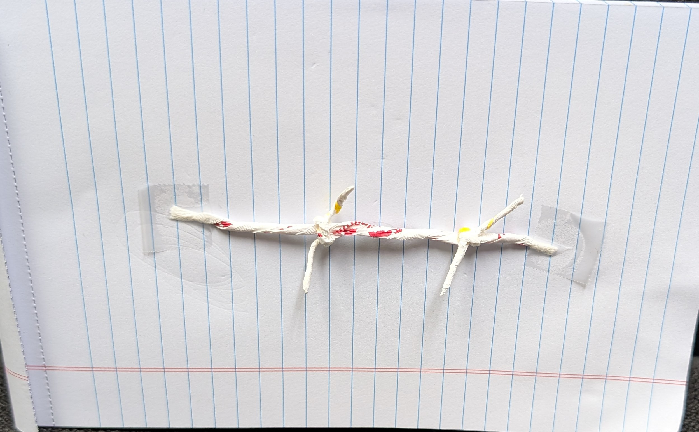 |  |   |
|:--:|:--:|:--:|:--:|:--:|

<!--
**everestso/everestso** is a ✨ _special_ ✨ repository because its `README.md` (this file) appears on your GitHub profile.

Here are some ideas to get you started:

- 🔭 I’m currently working on ...
- 🌱 I’m currently learning ...
- 👯 I’m looking to collaborate on ...
- 🤔 I’m looking for help with ...
- 💬 Ask me about ...
- 📫 How to reach me: ...
- 😄 Pronouns: ...
- ⚡ Fun fact: ...
-->
