# Considering AI and Air Force

  
  
  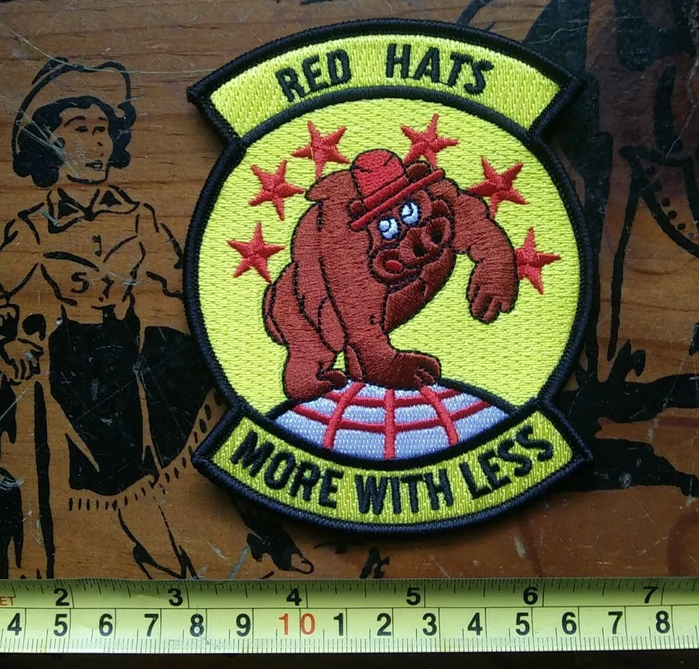
    

# Interesting Career Experience ✅ 

  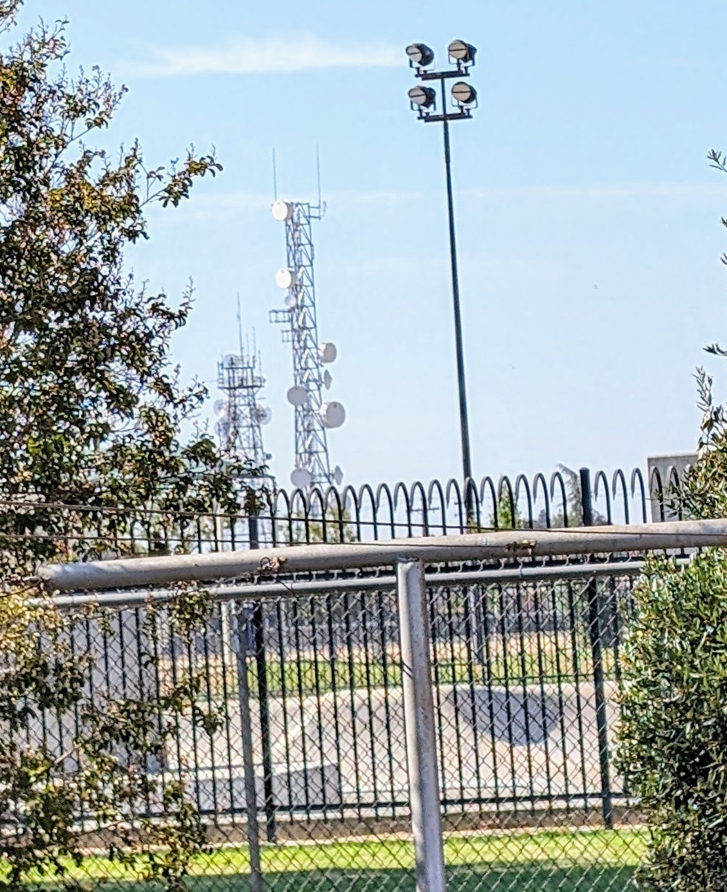
  
  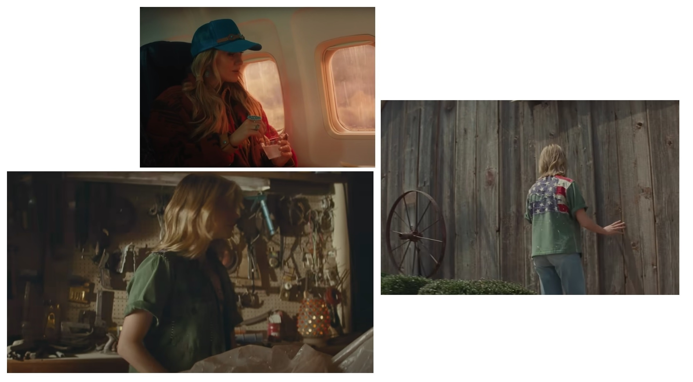  
  

    
  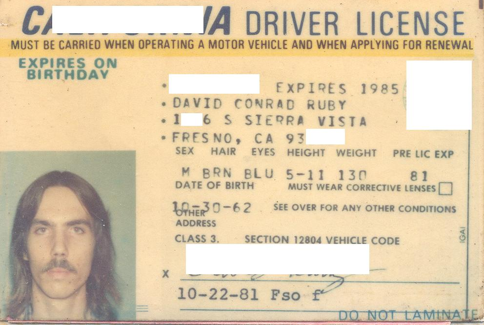✅   

# Lift

  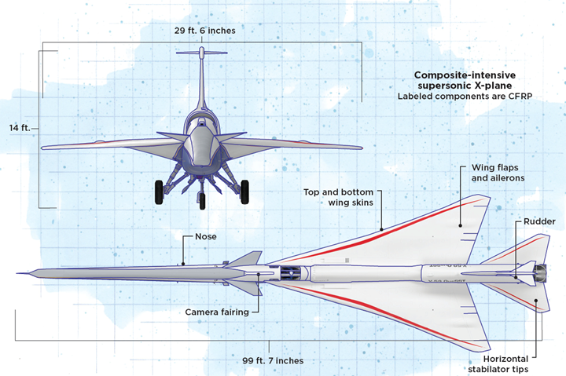
    
    

# Research Careers

  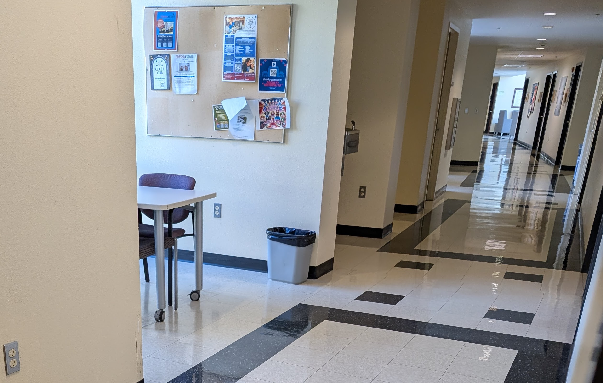
  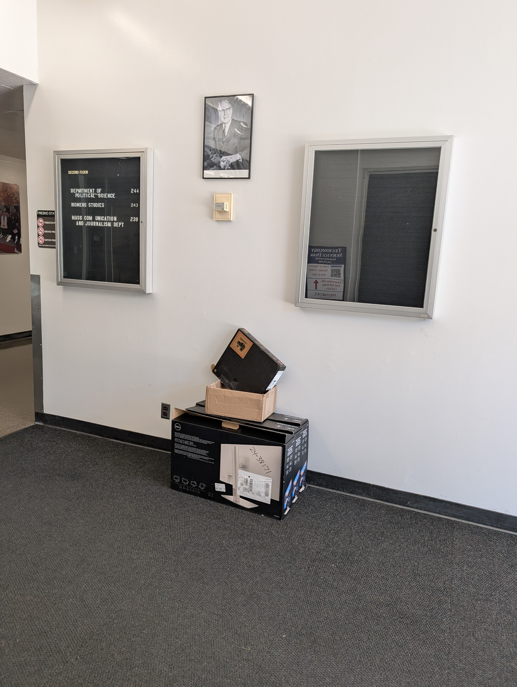  
   
    
  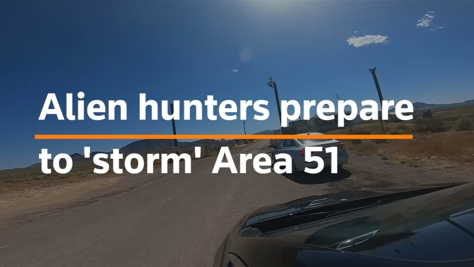  

# Research Military Ties

  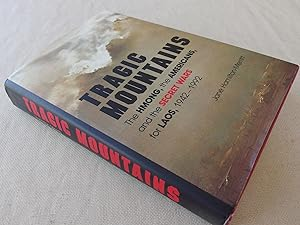

# Foundations of Computer Science Department

    
  
  
    

# More Lift ?

### How AI Models Are Helping to Understand — and Control — the Brain

    
  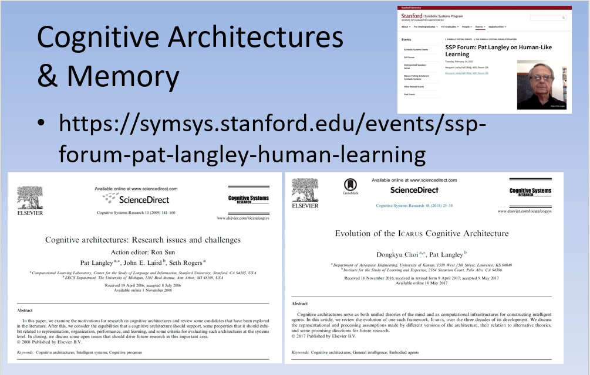
  
    
    

[https://www.quantamagazine.org/how-ai-models-are-helping-to-understand-and-control-the-brain-20250618/](https://www.quantamagazine.org/how-ai-models-are-helping-to-understand-and-control-the-brain-20250618/)

[https://www.epfl.ch/about/data/](https://www.epfl.ch/about/data/)

# Concerns / Issues

  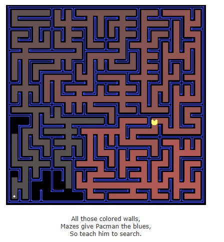 
       

<!--
**everestso/everestso** is a ✨ _special_ ✨ repository because its `README.md` (this file) appears on your GitHub profile.

Here are some ideas to get you started:

- 🔭 I’m currently working on ...
- 🌱 I’m currently learning ...
- 👯 I’m looking to collaborate on ...
- 🤔 I’m looking for help with ...
- 💬 Ask me about ...
- 📫 How to reach me: ...
- 😄 Pronouns: ...
- ⚡ Fun fact: ...
-->
