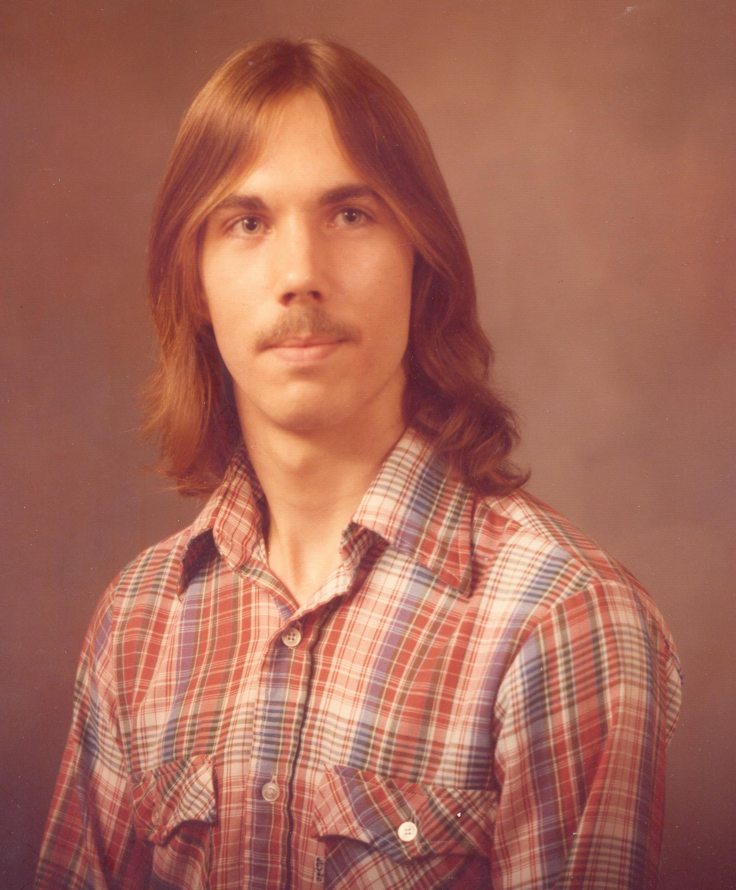
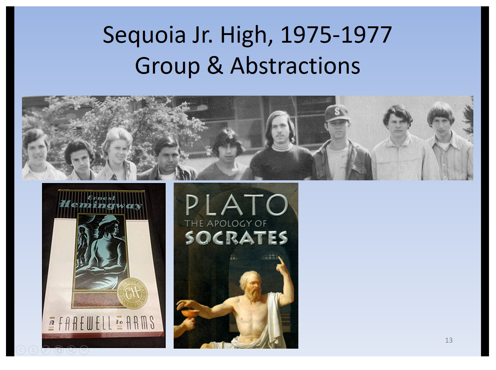
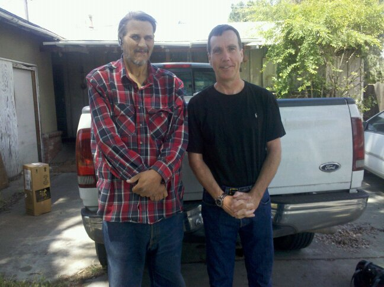

# 🌕 Crewed Moon Landings Summary (Apollo Program 1969–1972)

## Mission Highlights

### 🚀 Apollo 11  
- **Date:** July 20, 1969  
- **Landing Site:** Sea of Tranquility  
- **Crew:**  
  - Neil Armstrong (Commander)  
  - Buzz Aldrin (Lunar Module Pilot)  
  - Michael Collins (Command Module Pilot – remained in orbit)  
- **Highlights:**  
  - First human moon landing  
  - Armstrong: _“That’s one small step for [a] man, one giant leap for mankind.”_  
  - 2.5-hour EVA, 21.5 kg of lunar samples  

---

### 🚀 Apollo 12  
- **Date:** November 19, 1969  
- **Landing Site:** Ocean of Storms  
- **Crew:**  
  - Charles "Pete" Conrad (Commander)  
  - Alan Bean (Lunar Module Pilot)  
  - Richard Gordon (Command Module Pilot)  
- **Highlights:**  
  - Precision landing near Surveyor 3  
  - Retrieved hardware from Surveyor 3  
  - 7.5-hour EVA, 34 kg of samples  

---

### 🚀 Apollo 14  
- **Date:** February 5, 1971  
- **Landing Site:** Fra Mauro Highlands  
- **Crew:**  
  - Alan Shepard (Commander)  
  - Edgar Mitchell (Lunar Module Pilot)  
  - Stuart Roosa (Command Module Pilot)  
- **Highlights:**  
  - First use of MET lunar cart  
  - Shepard hit golf balls on the Moon  
  - 9-hour EVA, 42.6 kg of samples  

---

### 🚀 Apollo 15  
- **Date:** July 30, 1971  
- **Landing Site:** Hadley Rille / Apennine Mountains  
- **Crew:**  
  - David Scott (Commander)  
  - James Irwin (Lunar Module Pilot)  
  - Alfred Worden (Command Module Pilot)  
- **Highlights:**  
  - First use of Lunar Rover  
  - Galileo feather-and-hammer demo  
  - 18.5-hour EVA, 77 kg of samples  

---

### 🚀 Apollo 16  
- **Date:** April 21, 1972  
- **Landing Site:** Descartes Highlands  
- **Crew:**  
  - John Young (Commander)  
  - Charles Duke (Lunar Module Pilot)  
  - Thomas "Ken" Mattingly (Command Module Pilot)  
- **Highlights:**  
  - Highland terrain exploration  
  - Extensive use of Lunar Rover  
  - 20.2-hour EVA, 95.8 kg of samples  

---

### 🚀 Apollo 17  
- **Date:** December 11, 1972  
- **Landing Site:** Taurus–Littrow Valley  
- **Crew:**  
  - Eugene Cernan (Commander)  
  - Harrison Schmitt (Lunar Module Pilot, geologist)  
  - Ronald Evans (Command Module Pilot)  
- **Highlights:**  
  - Final Apollo moon mission  
  - First scientist–astronaut on Moon  
  - 22-hour EVA, 110.5 kg of samples  
  - Cernan: _“We leave as we came, and, God willing, as we shall return.”_

---

## 🧾 Summary Table

| Mission    | Date         | Landing Site         | Commander     | Lunar Pilot      | EVA Time | Samples |
|------------|--------------|----------------------|---------------|------------------|----------|---------|
| Apollo 11  | Jul 20, 1969 | Sea of Tranquility   | Armstrong     | Aldrin           | 2.5 hrs  | 21.5 kg |
| Apollo 12  | Nov 19, 1969 | Ocean of Storms      | Conrad        | Bean             | 7.5 hrs  | 34 kg   |
| Apollo 14  | Feb 5, 1971  | Fra Mauro Highlands  | Shepard       | Mitchell         | 9 hrs    | 42.6 kg |
| Apollo 15  | Jul 30, 1971 | Hadley–Apennine      | Scott         | Irwin            | 18.5 hrs | 77 kg   |
| Apollo 16  | Apr 21, 1972 | Descartes Highlands  | Young         | Duke             | 20.2 hrs | 95.8 kg |
| Apollo 17  | Dec 11, 1972 | Taurus–Littrow       | Cernan        | Schmitt          | 22 hrs   | 110.5 kg |

---

> ✨ *To date, these six Apollo missions remain the only crewed moon landings in history.*

# Sharing Transitions

|  |  |  |  |  |
|:--:|:--:|:--:|:--:|:--:|
| Elementary (67-74) | Sequoia Time (74-77) | Roosevelt (77-80) | US Amada Time (94-96) | Fresno State Redux (13-25) |

  
  

## Alternates

  

## Side Tracks ..

  
  
    

<!--

## Hi there 👋
**everestso/everestso** is a ✨ _special_ ✨ repository because its `README.md` (this file) appears on your GitHub profile.

Here are some ideas to get you started:

- 🔭 I’m currently working on ...
- 🌱 I’m currently learning ...
- 👯 I’m looking to collaborate on ...
- 🤔 I’m looking for help with ...
- 💬 Ask me about ...
- 📫 How to reach me: ...
- 😄 Pronouns: ...
- ⚡ Fun fact: ...
-->
