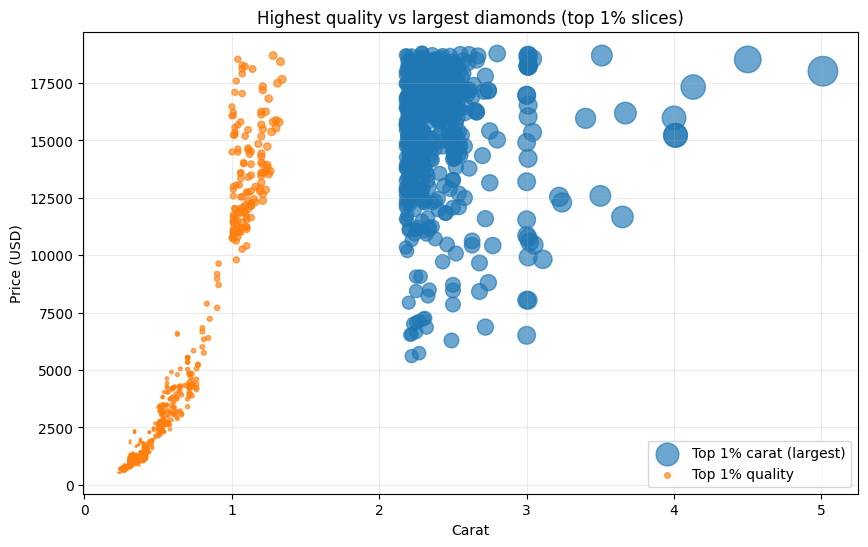
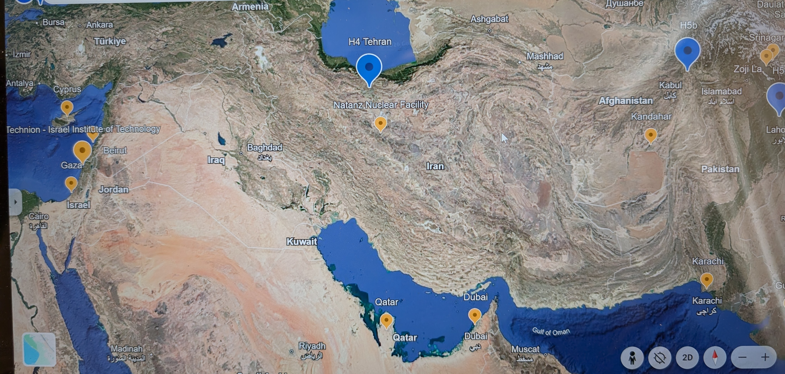
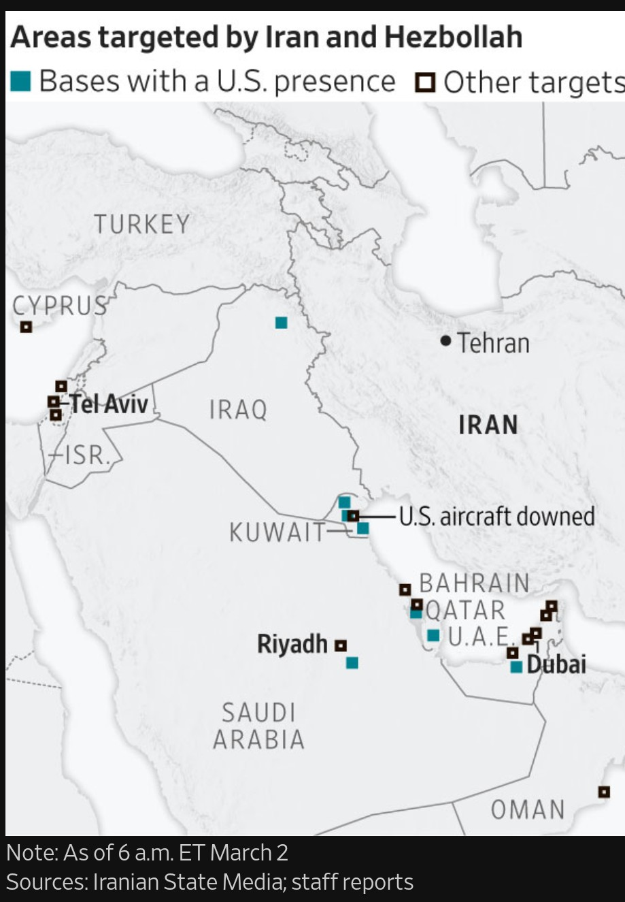

# Kurds in Iraq and Iran: Overview, Partnership Limits, and an AI-Enabled Analytic Direction

## Executive summary  
**(or: How AI Can Help Prevent a Wider Iran Crisis)**

The Kurds are a major ethno-linguistic community across Iraq and Iran (as well as Türkiye and Syria), but they are **not a single governing actor**. In **Iraq**, Kurdish self-rule is most institutionalized through the **Kurdistan Regional Government (KRG)** and **Peshmerga**, yet governance and security are shaped by enduring **KDP–PUK factional competition** and recurring **Baghdad–Erbil fiscal/oil disputes** that can disrupt salaries, service delivery, and policy continuity. In **Iran**, Kurds have **no autonomous region** and Kurdish political organization is heavily constrained by the state, limiting any realistic capacity for open territorial governance.

For partnership strategy, Kurdish actors can be **strong tactical partners** for bounded missions (local security coordination, stabilization support, humanitarian access, and selective intelligence collaboration), especially in Iraq. They are a **weaker choice for region-wide governance ambitions** because the political landscape is fragmented, fiscal autonomy is constrained, rights/legitimacy concerns can complicate credibility, and Kurdish entities remain highly vulnerable to pressure from stronger neighboring states and central authorities.

A more durable approach is to replace “single-partner” assumptions with **portfolio alliances** designed around **mission-specific reliability** and **shock resilience**. Advanced AI-enabled cultural intelligence—especially dialect-aware narrative analysis, coalition network mapping, early-warning indicators, and counterfactual “alliance stress tests”—can help analysts identify which actors can deliver what, under which conditions, and how to structure agreements that survive predictable stressors.

> **Analytic-use note (not targeting..):** This media-monitoring agent can also make security and stabilization efforts **more socially informed** by flagging likely civilian harm risks, backlash triggers, misinformation cascades, and legitimacy shocks—supporting **de-escalation**, **civilian protection**, and **post-war coalition durability**. It is intended for decision support and harm reduction, not tactical targeting.
[RegionalMediaWatch_AIAgent.md](RegionalMediaWatch_AIAgent.md)

## Brief overview: Kurds in Iraq and Iran

### Who they are
- The **Kurds** are a large, distinct **ethno-linguistic** community in the Middle East, with major populations in **Iraq, Iran, Türkiye, and Syria**.  
- In **Iran**, population estimates vary widely (often cited around **~7–15 million**, roughly **~8–17%** of Iran’s population).  
- Kurds speak several related **Kurdish dialects** (notably **Sorani** and **Kurmanji**) and are **religiously diverse**; in Iran many are **Sunni (Shafi’i)** and also **Shia**, alongside smaller communities.

---

## Iraq: Kurdistan Region of Iraq (KRI) / Kurdistan Regional Government (KRG)
- Iraqi Kurds have the region’s most developed Kurdish self-rule: the **KRG** is a **constitutionally recognized federal region** within Iraq, with its own security forces (**Peshmerga**) and institutions.  
- Politics is dominated by two long-standing parties: the **KDP** and **PUK**, whose rivalry has repeatedly shaped governance, security, and administration.  
- The KRG’s capacity is heavily affected by the **Baghdad–Erbil dispute** over **oil exports, revenues, and budget transfers**, which has contributed to recurring **salary crises** and political instability.

---

## Iran: Iranian Kurdistan
- Iranian Kurds live mainly in Iran’s **northwest** along the border with Iraq and Türkiye and face persistent state suspicion toward Kurdish political activism.  
- Unlike Iraq, Iran has **no Kurdish autonomous region**. Kurdish political groups exist (some in exile or operating clandestinely), but the Iranian state **sharply restricts** organization and armed activity—limiting the ability to build governing institutions on Iranian territory.

---

## Why partnering with “the Kurds” can be a weak choice (in practice)

> Key premise: It’s not accurate to treat an entire people as “unable to rule.” The practical concern is that Kurdish political actors in Iraq and Iran face **structural constraints** that can make them **unreliable as a single, region-wide governing partner**, especially for projects requiring coherent sovereignty.

### 1) They are not a unified actor
- In Iraq, the KRG has often functioned less like one integrated state and more like a **power-sharing arrangement** between **KDP- and PUK-aligned zones**, with duplicated chains of command and recurring disputes.  
**Partnership risk:** agreements made with one Kurdish power center may not bind the other, complicating security coordination, contracting, and policy follow-through.

### 2) Governance capacity is constrained and periodically paralyzed
- The KRG has faced extended periods of **political deadlock** and difficulty forming or sustaining governing coalitions, reflecting deep internal competition.  
**Partnership risk:** slow decision-making, unpredictable policy shifts, and weak enforcement of region-wide reforms.

### 3) Fiscal dependence undermines autonomy
- The KRG’s finances are highly exposed to **oil revenue disputes** with Baghdad and to the status of export arrangements. These disputes have translated into **salary nonpayment** and public-sector instability.  
**Partnership risk:** even if Kurdish leaders agree to a plan, they may lack stable revenue to execute it without Baghdad’s cooperation (or a durable export framework).

### 4) Rule-of-law and rights concerns can damage partner credibility
- Credible monitors have reported **restrictions on freedoms** in the Kurdistan Region (e.g., pressure on journalists and civic space), even while noting occasional corrective steps.  
**Partnership risk:** reputational costs, domestic backlash, and reduced durability of cooperation if governance is perceived as **party-dominated** rather than institutional.

### 5) Extreme vulnerability to regional power pressure
- Kurdish entities operate under constant pressure from stronger neighbors and federal authorities (**Baghdad, Tehran, Ankara**), limiting room to maneuver and making long-term commitments fragile.  
**Partnership risk:** sudden escalations, cross-border strikes, sanctions/embargoes, or legal challenges can rapidly change the operating environment.

### 6) In Iran specifically: limited ability to “rule” because they don’t control territory
- Iranian Kurdish groups generally do not hold recognized governing authority inside Iran; they cannot reliably deliver public administration, security, or services at scale under the current Iranian state structure.  
**Partnership risk:** they may be relevant as advocacy or opposition actors, but they are typically not positioned to govern territory without major regime or constitutional change.

---

## Bottom line
Partnering with Kurdish actors can be **valuable for specific aims** (local security cooperation, intelligence, stabilization in certain areas, humanitarian delivery), particularly in **Iraq**, where institutions exist. But it can be a **weak choice** if the objective is **region-wide effective governance**, because Kurdish politics is **fragmented**, **fiscally constrained**, and **externally hemmed in**—and in Iran, Kurdish actors generally **cannot govern openly** at all under current conditions.

---

# Possible direction: AI-enabled cultural intelligence to build better alliance ideas (Analyst outline)

> Note: This is a **conceptual, non-operational** outline focused on **analysis and decision support**, not tradecraft.

## Analytic objective
Build a **culture-forward alliance strategy** that:
1) avoids treating “the Kurds” as a monolith,  
2) identifies **which Kurdish actors can reliably deliver** on which commitments, and  
3) maps realistic **coalition structures** that survive party rivalry, fiscal shocks, and external pressure.

## Data “layers” to integrate (all-source, culture-forward)
1. **Institutional layer (governance reality)**
   - party control zones, ministry effectiveness, patronage networks, budget/salary stability, service delivery signals.
2. **Societal layer (legitimacy + identity)**
   - tribal/clan influence, urban/rural cleavage, youth politics, religious networks, diaspora influence, narratives of grievance and pride.
3. **Economic layer (capacity + fragility)**
   - oil/revenue chokepoints, public payroll dependencies, cross-border trade routes, sanctions exposure, smuggling incentives.
4. **Security layer (coercion + cohesion)**
   - command-and-control coherence, factional force alignment, conflict spillover risk, external strike vulnerability.
5. **Information layer (narratives + perception)**
   - sentiment shifts across local languages, rumor cascades, media trust, elite messaging divergence.

## What “new” AI adds (beyond older methods)
1. **Dialect-aware cultural NLP at scale**
   - robust processing across Sorani/Kurmanji and code-switching (Kurdish–Arabic–Persian–Turkish), enabling fine-grained narrative mapping.
2. **Identity and coalition graph modeling**
   - dynamic network graphs linking parties, families, business nodes, militias, religious figures, civil society actors—tracking who influences whom and when alliances shift.
3. **Early-warning cultural drift**
   - anomaly detection for legitimacy shocks (e.g., salary crises, corruption scandals, external strikes) and which sub-communities are most likely to fracture.
4. **Counterfactual simulation (“alliance stress tests”)**
   - simulate how proposed partnerships behave under known stressors: budget cutoff, border closure, intra-party split, external coercion.
5. **Micro-region segmentation**
   - move from “Kurdish region” to micro-regional profiles (district-level) to avoid one-size-fits-none policy.

## Analyst workflow (outline)
1. **Define the decision question**
   - “Partner for what?” (stabilization, intelligence access, border security, humanitarian corridors, governance support, etc.)
2. **Segment the actor landscape**
   - break “Kurds” into actual political and administrative units: KDP-aligned, PUK-aligned, independent technocrats, municipal networks, civil society nodes, diaspora channels.
3. **Score reliability by mission type**
   - create a matrix: actor × mission with metrics like cohesion, fiscal autonomy, legitimacy, and external vulnerability.
4. **Generate alliance candidates**
   - propose portfolio partnerships rather than a single bet:
     - tactical partnerships (time-bound, narrow deliverables)
     - institutional partnerships (capacity-building with governance safeguards)
     - bridging partnerships (cross-faction mechanisms to reduce single-point failure)
5. **Run stress tests**
   - evaluate which alliance structures survive plausible shocks.
6. **Produce decision-ready outputs**
   - short list of 2–4 alliance architectures, each with:
     - expected benefits
     - key failure modes
     - early-warning indicators
     - mitigation levers

## Example alliance ideas the framework tends to favor (high level)
- **Not one partner, but a portfolio:** partner with multiple nodes that cover different functions (security coordination, service delivery, logistics, local legitimacy).  
- **Mechanism-first partnerships:** focus on shared mechanisms (joint committees, transparent disbursement triggers, third-party audit structures) rather than personalist deals.  
- **Local legitimacy gates:** require demonstrable local buy-in (municipal cooperation, civil society participation) before scaling support.  
- **Shock-resilient designs:** assume fiscal disruption and external coercion; build alliances that degrade gracefully rather than collapse.

# Euro Luxury Love
+ [https://youtu.be/AyDJNjE2ClU?si=VCPkFieH_fdeUItW](https://youtu.be/AyDJNjE2ClU?si=VCPkFieH_fdeUItW)
+ [https://youtu.be/8RtVIKnjbFY?si=A4j4Y1dopFIKrqVU](https://youtu.be/8RtVIKnjbFY?si=A4j4Y1dopFIKrqVU)
+ [https://youtu.be/B0Sgb-pyvKs?si=ALp8pCSVbdiUluy6](https://youtu.be/B0Sgb-pyvKs?si=ALp8pCSVbdiUluy6)
+ [c126s26_NEON_1b.ipynb](c126s26_NEON_1b.ipynb)
  
|  |   |  |
|:--:|:--:|:--:|
|  |   |  |

[https://www.ritani.com/products/112-cttw-pear-and-round-lab-grown-diamond-necklace](https://www.ritani.com/products/112-cttw-pear-and-round-lab-grown-diamond-necklace)

# Euro-Youth Organizations

+ [https://www.greenpeace.org/international/](https://www.greenpeace.org/international/)
+ [https://www.peta.org/](https://www.peta.org/)
+ [https://www.eurovision.com/](https://www.eurovision.com/)

### Protesting versus Organizing

+ [https://youtu.be/XEjLoHdbVeE?si=td_nR0Zt2a_vvKpu](https://youtu.be/XEjLoHdbVeE?si=td_nR0Zt2a_vvKpu)
+ [https://youtu.be/wWQ7wrPyUe0?si=D7UZLcWnVpeti3oO](https://youtu.be/wWQ7wrPyUe0?si=D7UZLcWnVpeti3oO)
+ [https://youtu.be/0QpTqYoEzto?si=rYsaaYr6u0bXNRvt](https://youtu.be/0QpTqYoEzto?si=rYsaaYr6u0bXNRvt)
+ [IKEA](https://youtu.be/9m3ywiWG7N8?si=WvkStOvNL9qHVCm9)

### Virtual Reality / AI

+ [https://youtu.be/m2qS3CF2aNA?si=7nTVro4FUzIzCp0J](https://youtu.be/m2qS3CF2aNA?si=7nTVro4FUzIzCp0J)
+ [https://youtu.be/09f7jnE2zwE?si=ami6Fx0mw0QOAnxy](https://youtu.be/09f7jnE2zwE?si=ami6Fx0mw0QOAnxy)

|  |   |  |
|:--:|:--:|:--:|
| **Left 1** |   | **Right 1** |

<!--
**everestso/everestso** is a ✨ _special_ ✨ repository because its `README.md` (this file) appears on your GitHub profile.

Here are some ideas to get you started:

- 🔭 I’m currently working on ...
- 🌱 I’m currently learning ...
- 👯 I’m looking to collaborate on ...
- 🤔 I’m looking for help with ...
- 💬 Ask me about ...
- 📫 How to reach me: ...
- 😄 Pronouns: ...
- ⚡ Fun fact: ...
-->
