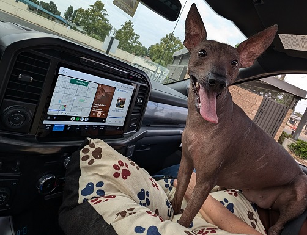

✨ I’m reflecting ... First Full Week or Second Week..:   

+ Mid Weekend : Contrasting -- Fresno State / Home @ South East Fresno

+ [Mid Weekend Sounds](https://open.spotify.com/playlist/5eBTRBnpuaqcs2C5GXQhtA?si=ARCVA2USSnqq22uXAw9wtA)

+ Changing Directions North:

+ [Changing Directions North](https://open.spotify.com/playlist/6kD8Z13PVtVEIDEF0v7Fpe?si=8aff65aed35b45b4)

## First Full Week or Second Week.. Soundtrack Evolution ..
  
[Soundtrack 1](https://open.spotify.com/playlist/34l0PnLEhuMkfMfBDpWIP8?si=79fb6fe3fad04764)     
[Soundtrack 2](https://open.spotify.com/playlist/3Reev4a1FYYoe2ETeEvzsx?si=10ff567a0e664662)   
### [Soundtrack 3](https://open.spotify.com/playlist/2AQPrH5yUe148VqAAyMiJT?si=ac8ef262ce5f45b4)   

[Soundtrack 3+](https://open.spotify.com/playlist/4xFdSQUcaTjesAPbLDsDTC?si=6bbb193edbe44fa2)

.
[++ Final Reflections ..](https://open.spotify.com/playlist/3OYHjcCljRjdw5RhQuQEFe?si=1900b7eec94c4151)

[Direction: Getting Robots into the Factory for faster iterative evolution...](https://youtube.com/playlist?list=PLtaUvM3y7tSjkK8ZoLDtfnN2N2pMzjWoe&si=CD495gcuYFCloq_y)

<!--   COMMENTS

✨ I’m currently considering ... ambient and additional sounds.   
+ What kind of images can sound prompt generate: Scene, Story, Conflict, Memories...?
+ How would sound prompts influence neural models differently then text or image prompts?
+ What kinds of sound prompts would form a language model:: Bar sounds: Breaking Glass, Laughter; Street Sounds Birds, Cars?
+ Office Sounds: Muffled Voices through walls, footsteps down halls, Doors closing, Doors locking...?

Possible Application: Security Sytems able to recognize something out of ordinary from sounds alone.   

Sounds for Diagnostics: [https://blog.google/technology/health/ai-model-cough-disease-detection/?linkId=10693143](https://blog.google/technology/health/ai-model-cough-disease-detection/?linkId=10693143)

[Soundtrack .... . .-.. .-.. ---](https://open.spotify.com/playlist/1uwvfn7v1tDOLKS15Tgofg?si=15ad1522372846a3)

[Soundtrack S](https://open.spotify.com/playlist/3X4ZughfRCufqv6tt2OoEo?si=5jBIe2AuSjeQgunP6d06cA&pi=J3XMSlKwR3iyr)

[Jetson Nano 1](https://learn.nvidia.com/courses/course-detail?course_id=course-v1:DLI+S-RX-02+V2)    
[Jetson Nano 2](https://www.sparkfun.com/products/17244)    
[Jetson Nano Step 3](https://www.sparkfun.com/products/22098)    

.
[Hackster Help .](https://youtu.be/oR3-5jxaUCg?si=sAWBFLyIpKQIxjBf)      
[Soundtrack A](https://open.spotify.com/playlist/0GV1EEYA8zOm3i3ZZLygvP?si=71928c82c7654b8c)

[New Desktop Option ](https://www.sparkfun.com/products/22099)     

[Exploring Educational Themes (Origin Stories)... Drafting Ideas!](https://drive.google.com/file/d/1t0xefX7JGep_uy4YzJ7Qh03h2-LnS6DY/view?usp=drive_link)

[Figures Interactive](https://udlbook.github.io/udlfigures/)

# Summer 24

# THINKing... themes for semester start Fall 24.

--------------------------------------------------------

**everestso/everestso** is a ✨ _special_ ✨ repository because its `README.md` (this file) appears on your GitHub profile.

Here are some ideas to get you started:

- 🔭 I’m currently working on ...
- 🌱 I’m currently learning ...
- 👯 I’m looking to collaborate on ...
- 🤔 I’m looking for help with ...
- 💬 Ask me about ...
- 📫 How to reach me: ...
- 😄 Pronouns: ...
- ⚡ Fun fact: ...
-->
