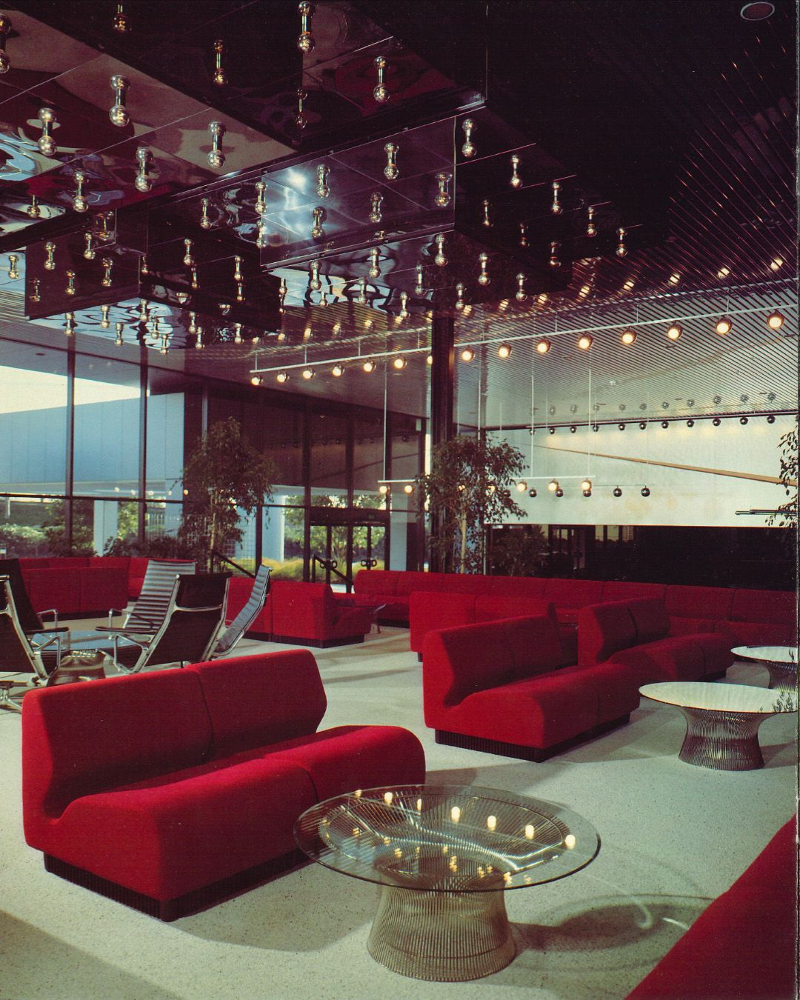
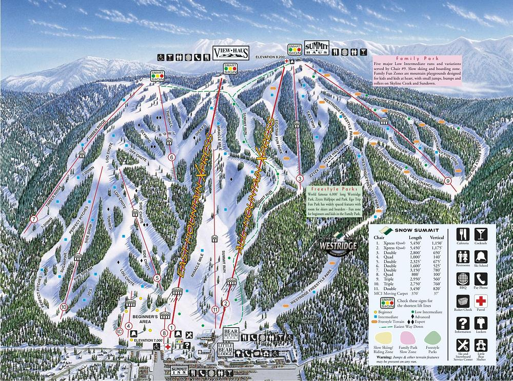
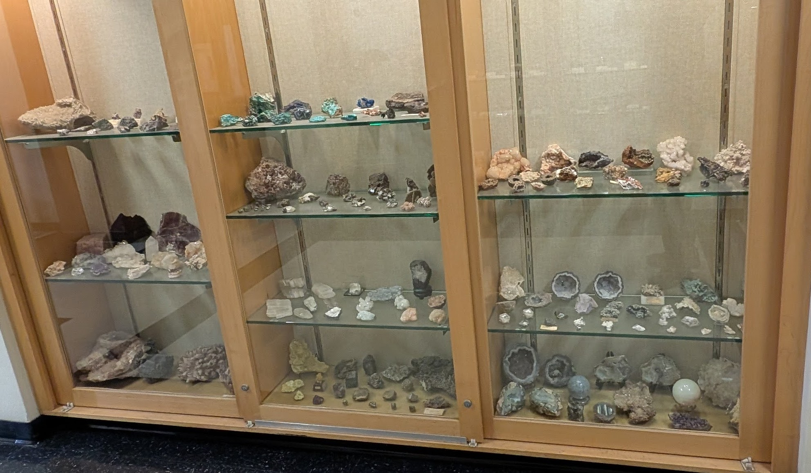
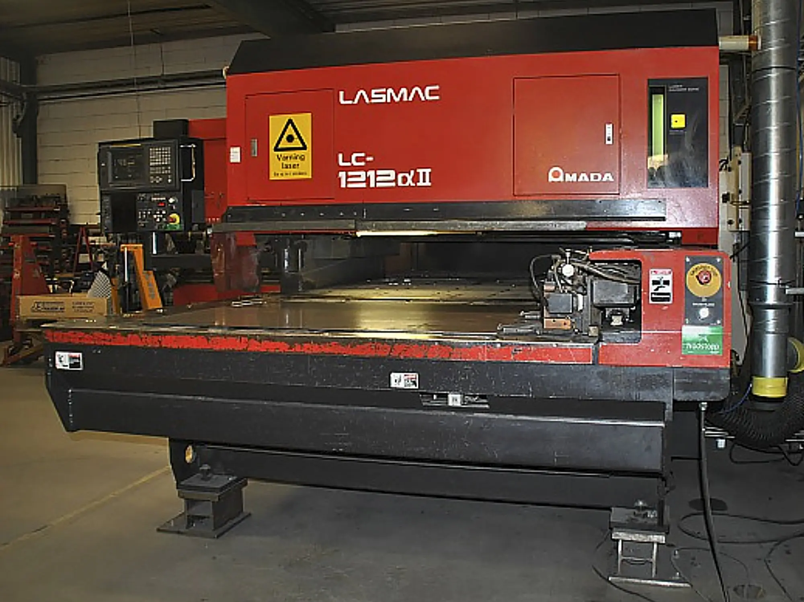
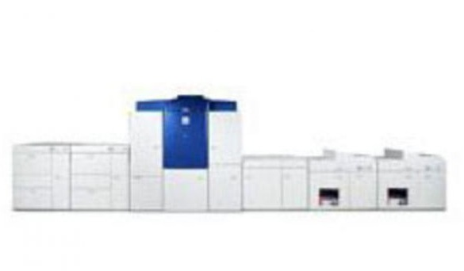
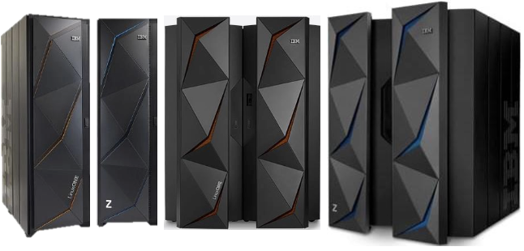

# Job Conditions / Properties

## US Amada: 2/1994 --- 2/1996

  
  
    
  

  
  

[Independence -- ENERGY](https://www.wsj.com/world/china/the-engineering-marvel-that-china-hopes-will-help-wean-it-off-foreign-energy-f8f91e92)

  
  

<!--
**everestso/everestso** is a ✨ _special_ ✨ repository because its `README.md` (this file) appears on your GitHub profile.

Here are some ideas to get you started:

- 🔭 I’m currently working on ...
- 🌱 I’m currently learning ...
- 👯 I’m looking to collaborate on ...
- 🤔 I’m looking for help with ...
- 💬 Ask me about ...
- 📫 How to reach me: ...
- 😄 Pronouns: ...
- ⚡ Fun fact: ...
-->
